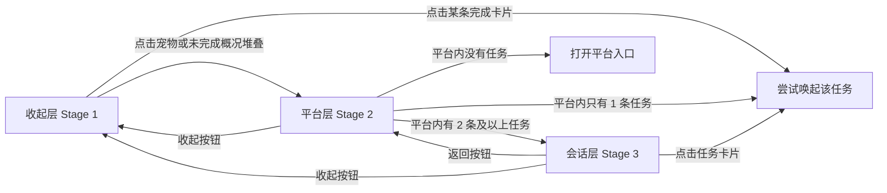

# AllPet 当前功能设计说明

版本：v1.4.1；记录日期：2026-09-26。本文随主程序仓库保存，描述发布版本的实际实现、用户操作与边界。开发中的会话导出与独立生成器不随此版本发行，相关记录单独标明。

发布变更见 [CHANGELOG](../CHANGELOG.md)，安装及测试结果见 [v1.4.1 发布说明](releases/v1.4.1.md) 与 [平台行为验收](平台行为验收.md)。

交互行为速查：第 15 章逐项说明点击、悬停、拖动、确认/取消后会发生什么；基础机制与实现限制仍在第 3–13 章。

## 1. 记录口径与功能全景

本文中的“已实现”表示当前源码中存在对应功能路径，不能替代在真实平台上的验收。“有限制”表示明确受平台、数据、权限或现有实现约束。“开发中”表示开始本次工作前已经存在的未提交内容，尚未作为发布功能验收。

| 功能域 | 当前能力 | 状态与边界 |
| --- | --- | --- |
| 多平台监控 | Codex、Claude Code / Desktop、DSH、Grok、Cursor、WorkBuddy、Qoder、pi、Z Code 本地活动检测 | 已实现；依赖各自日志格式 |
| 任务信息 | 会话名称、当前动作、工具名称、可解析的 Todo 进度、状态、定位信息 | 已实现；不是平台全部历史的镜像 |
| 并发会话 | 除 Grok 外的平台最多输出 5 条近期任务 | 已实现；Grok 实时输出仍为一个选中任务 |
| 桌宠显示 | macOS 原生 AppKit、三平台 Electron 壳 | 已实现；不同系统的窗口/托盘能力有差异 |
| 状态动画 | 6 类任务阶段映射到 9 组标准动作 | 已实现 |
| 任务气泡 | 收起、平台、会话三个层级；平台分页、完成通知与历史 | 已实现 |
| 平台显示设置 | 九平台独立勾选、全部显示/隐藏、重启保留 | 仅控制气泡；后台监控与历史继续 |
| 通知清除 | 手动关闭、九平台终态点击即确认、24 小时过期 | 已实现；本轮修复见第 6 节 |
| 返回任务 | macOS 终端/桌面/浏览器定位；Electron 按来源选择可用方式 | 有限制，见第 7 节 |
| 宠物管理 | 发现、切换、默认目录安装、GitHub 安装、导入、删除、刷新 | 已实现；多格式转换依赖 macOS |
| 自制宠物工具 | 提示词模板、标准帧适配、拼图、校验、预览、打包 | 已实现；主程序没有集成图像生成服务 |
| 历史会话索引与文本导出 | 按日期索引会话、按会话/日期导出规范化文本 | 开发中、未提交，见第 11 节 |
| 安装包构建 | Electron + Swift sidecar；DMG / ZIP / AppImage / DEB / NSIS | v1.4.1 发布目标；构建结果见版本发布说明，不能替代各系统实机验收 |
| 自动更新 / 云同步 | 未见实现 | 未实现 |

会话导出属于独立开发内容，未纳入 v1.4.0/v1.4.1 的源码提交或安装包；下文保留设计记录，不把它作为可用命令。

## 2. 产品职责与技术架构

AllPet 是一个桌面上的 AI 编码任务状态入口。用户在原平台发起任务，AllPet 读取该平台写到本机的日志，转换成统一状态，以宠物动作和任务气泡呈现；用户点击任务时尝试回到原应用、终端标签页或 DSH 浏览器会话。

监控不需要用户输入模型账号、密码或 API key。任务执行、模型调用、工具审批和对话回复仍由原平台负责；AllPet 没有统一聊天输入框，也没有替用户运行任务的调度器。宠物下载、GitHub 安装以及任务唤起会使用网络或系统应用能力，这与只读的本地监控分开。

```text
各平台本地日志 / 会话元数据
           ↓
Swift AllPetCore：扫描 → 解析 → 状态归类 → 多平台快照
           ├── allpet status / watch / pet … CLI
           ├── macOS AppKit：PetApp + TaskTrayView + TaskLauncher
           └── watch --json（NDJSON）→ Electron 主进程 → renderer
```

| 层 | 主要职责 | 实现 |
| --- | --- | --- |
| `AllPetCore` | 配置、日志扫描、九平台适配、统一数据模型、动画表、宠物格式与安装 | Swift；`Package.swift` tools 5.10 |
| 原生 macOS | 透明窗口、菜单栏、气泡历史、唤起、系统交互 | AppKit；最低 macOS 14 |
| Electron | 三平台透明窗口、托盘、宠物管理、历史、调用 sidecar | `desktop/main.js`、preload、HTML/CSS/JavaScript |
| sidecar | 复用核心，持续输出快照和处理宠物命令 | 同包 `allpet` / `allpet.exe` |
| 制作工具包 | 制作符合图集约定的宠物资源 | Python + Pillow；不属于常驻运行时 |

Electron 依赖声明为 Electron `^44.2.0`、electron-builder `^26.15.3`，应用包版本字段为 `1.4.0`。这些是本地配置值，不是“最新官方版本”声明。

## 3. 数据模型与状态规则

### 3.1 平台、任务、快照

平台顺序固定为 Codex → Claude Code → DSH → Grok → Cursor → WorkBuddy → Qoder → pi → Z Code。统一阶段为 `idle` 空闲、`running` 运行中、`thinking` 思考中、`waiting` 等待中、`done` 完成、`failed` 出错。

`TaskInfo` 保存稳定会话名 `sessionName`、本轮任务标题 `title`、当前动作 `action`、工具名、已完成/总步骤、平台会话 ID、日志来源路径、工作目录、进程 ID、TTY、终端绑定、启动来源、Claude 定时任务名及任务自身阶段。终端绑定还包括锚点进程 ID 与进程启动时间，用来避免仅靠可能复用的 TTY 定位错误窗口。

`PlatformStatus` 保存平台级阶段、说明、最后活动时间、近期会话数、开关、主任务和任务数组。`task` 是兼容字段，通常对应 `tasks.first`。平台阶段由该适配器选出的主任务决定，并不是对该平台每一条任务再做一次优先级聚合；数组里的任务可以各有不同阶段。

`PetSnapshot` 保存九平台结果、汇总阶段、动画、概况文字与观察时间。跨平台优先级为：

```text
failed > running / thinking > waiting > done > idle
```

对应动作是 `failed`、`running`、`waiting`、`review`、`idle`；思考和运行在全局动画层合并为运行。概况由非空闲平台的“平台名 + 阶段”组成，全空闲时为“全部空闲”。GUI 根据过滤后的可见状态重算动画；菜单状态仍可显示原始监控快照。

### 3.2 通用时间推断

| 条件 | 默认结果 |
| --- | --- |
| 距活动不超过 8 秒 | running；检测到错误则 failed |
| 超过 8 秒、不超过 120 秒 | waiting |
| 超过 120 秒 | idle |

明确解析出的 running / thinking 只在 8 秒内覆盖时间推断；waiting 在 120 秒内覆盖；done / failed 为终态，不因上述时间窗口自动降成 idle。日志出现新活动时可覆盖终态。**终态分类、扫描候选窗口、GUI 历史 24 小时保留是三个不同层次**，不能据“终态保留”推导 CLI 会永远输出某条完成日志。

Codex 使用单独的阶段解析逻辑：running / thinking / waiting 在解析层可保留到 1,800 秒，done / failed 保留。但当前 Codex 扫描仍只解析 `recentCandidates`，默认仅包含 120 秒内修改的文件，因此静默 120 秒后的会话可先退出候选。当前不能承诺长任务一定持续显示满 30 分钟。

### 3.3 展示文案

卡片主标题显示稳定会话名，不直接用本轮用户提示词作为会话名。Claude 定时任务显示“定时任务 · 名称”；无会话名但有 ID 时显示“会话 <ID 前 8 位>”，DSH 的 `session-` 前缀不占这 8 位；再无 ID 则为“未命名会话”。

“会话 + 前8位”是**名称缺失时的显示回退**，不是一种新任务类型，也不能据此认定该任务无效。例如真实的Codex用户/CLI/VS Code会话尚未命名、名称索引没有对应记录或读取失败时，仍可显示此回退名称；其整张卡片和普通有名任务有相同的点击/关闭行为。Codex内部的`guardian_review`审查会话和子代理则按来源metadata过滤，不应仅因没有名称而混入列表，也不能用“隐藏所有UUID样式标题”解决这类误展示。

动作、工具与进度显示在副标题。工具名被翻译为“运行命令 / 读取文件 / 写入文件 / 修改文件 / 搜索内容 / 查找文件 / 搜索网络 / 读取网页 / 更新任务计划 / 加载技能 / 调用子代理”等。工具参数只截取适合显示的摘要。进度格式为“进度 已完成/总数”。

## 4. 九个平台的监控与识别

| 平台 | 默认监控位置 | 会话名称来源 | 实时多会话 |
| --- | --- | --- | --- |
| Codex | `~/.codex/sessions/**/*.jsonl` | `.codex/session_index.jsonl` 的最新 `thread_name` | 最近候选解析后最多 5 条 |
| Claude | `~/.claude/projects/**/*.jsonl` | `custom-title`；Desktop metadata 标题；定时任务名 | 命名或定时任务最多 5 条 |
| DSH | `~/.dsh/sessions/**/session.jsonl.zstd` | 投影缓存 title，回退 transcript `session/title` | 主会话 + 近期顶层会话最多 5 条 |
| Grok | `~/.grok/logs/unified.jsonl` + `~/.grok/active_sessions.json` | active session 的 cwd 最后一段，排除 home 本身 | 可计数多会话，但仅输出一个选中任务 |

### 新平台接入概览

| 平台 | 默认本地来源 | 稳定标题与完成识别 | 首次使用 |
| --- | --- | --- | --- |
| Cursor | `~/.cursor/projects/**/agent-transcripts/**/*.jsonl`，兼容 `.txt` | 首个用户文本；Stop hook 确认终态 | 菜单“实时状态接入 → 启用/修复 Cursor” |
| WorkBuddy | `~/.workbuddy/projects/**/*.jsonl` | `ai-title`，回退首个用户文本；assistant `status=completed` | 打开 WorkBuddy 开始新任务 |
| Qoder | `~/.qoder/projects/**/*.jsonl` | 原生 title/首个用户文本；Stop progress 或 Stop hook | 菜单“实时状态接入 → 启用/修复 Qoder”，重启 Qoder |
| pi coding agent | `~/.pi/agent/sessions/**/*.jsonl` | session_info.name，回退首个用户文本；stopReason | 在现有 pi 终端开始新任务 |
| 智谱 Z Code | `~/.zcode/cli/db/db.sqlite` | session.title；assistant.finish/error、tool 状态 | 打开 Z Code 开始新任务 |

这里的 pi 是 pi coding agent，Qoder 不写作 Qorder。五个平台均接入同一状态模型、气泡历史、颜色、分页、显示开关、单项/平台关闭和点击确认。不同平台的原会话定位能力见第 7 章，不能将“显示支持”理解为全部提供相同的外部导航接口。

### 4.1 Codex

- 扫描 JSONL，依据会话metadata的`originator`、`source`、`thread_source`识别来源；排除DSH来源、Codex子代理和`guardian_review`内部审查会话，避免跨平台重复、内部工作记录与用户会话混排。
- 来源识别兼容旧式字符串与新式结构化metadata；例如`source={"subagent":{"thread_spawn":{…}}}`同样是内部子代理，不能只匹配`thread_source == "subagent"`。`guardian_review`会话即使没有人类可读标题、显示上会回退UUID，也依据来源排除。
- 正常user、CLI、VS Code等用户会话继续保留，包括没有会话名称的情况；不按UUID、标题前缀或是否命名一刀切隐藏。名称显示回退与来源过滤是独立规则。
- session ID 优先取 rollout 文件名中的第一个 UUID，metadata 为回退。启动来源由 transcript 身份查询补齐，用于区分 CLI 与 Desktop。
- 用户消息更新本轮标题；助手文本为“正在生成回复”；reasoning 为思考；工具调用为运行，命令/工具结果处理转思考。
- `task_started` 为思考；Plan 开始为生成计划、Plan 完成为 waiting；`task_complete` 无错误为 done，有错误为 failed；明确失败事件为 failed；取消或中断为 waiting。
- 会话索引单文件读取上限 4 MiB，同一个 ID 的后一次重命名覆盖前一次，展示名称上限 90 字符。

### 4.2 Claude Code 与 Claude Desktop

- 排除 `/subagents/` 路径。既没有会话名，也没有定时任务名的临时会话被过滤；因此普通未命名 CLI 会话也可能不显示。
- 日志 `entrypoint` 与首尾身份信息帮助识别 Desktop 来源。Desktop metadata 从 `~/Library/Application Support/Claude-3p/claude-code-sessions` 和 `~/Library/Application Support/Claude/claude-code-sessions` 查找。
- 用 transcript 的 CLI UUID 查 metadata 中 `cliSessionId`，得到已有的 `local_*` Desktop 会话。多个关联项选择最早创建的未归档原任务；最多检查 4,000 个 JSON，每个不超过 128 KiB，超过总扫描上限则不使用截断集合猜测原任务。
- `queue-operation/enqueue` 可识别定时任务名及排队 waiting；自定义标题提供稳定会话名。定时任务按名称归并，不把每天运行都当成新通知。
- 人类 user 消息转 thinking；工具调用转 running；thinking block 转 thinking；助手文本转 running；成功工具结果转 thinking；API 错误或错误工具结果转 failed。
- `stop_reason=end_turn/stop_sequence` 判 done，`tool_use` 判 running。普通 sidechain / 非 human 来源消息不会被当作新的用户任务标题。

### 4.3 DSH

- 仅监控父目录名以 `session-` 开头的顶层会话，避免子代理独立气泡。`DSH_SESSION_JSONL` 可以提高指定会话的主任务选择优先级，但仍受相对最新文件的候选宽限约束。
- 主候选按优先级选出，再补充近期会话，按路径去重并最多解析 5 个。每个任务保留自身阶段。
- `turn/start` / `step/start` 为 thinking；工具调用为 running；工具结果成功后 thinking、失败则 failed；`todo/write` 统计 completed 数量和总数，显示首个 in_progress 项。
- `turn/end` 的 completed 为 done；error / max-tokens 为 failed；aborted / interrupted / blocked 为 waiting；其他非空结束原因显示 waiting 和原因。助手 chunk 的 reasoning/text/tool 事件也可推进动作。
- 名称优先从 `~/.dsh/storages/session_projcache/sessions/<sessionID>.json` 的 `record.rows.title.val` 读取；`DSH_HOME` 可改此名称查询根目录，不会自动替换监控配置的 `platforms.dsh.paths`。
- 解码器缓存最多 5 个路径，以 mtime + 文件大小辨别版本。输入变化但仍在防抖期时，旧文本仅作上下文，不能把旧 done 状态套到新活动。
- 压缩输入小于 10 MB / 10–50 MB / 至少 50 MB 时，基础解码间隔分别为 4 / 8 / 15 秒，并取上一耗时的 4 倍，最大 30 秒；硬超时分别为 12 / 25 / 45 秒。
- zstd 必须从头解码，但内存只保留约 2,000,000 字节尾部和有限标题、用户、turn、todo 上下文；上下文单行最多 131,072 字节。超时会终止解码进程。
- 独立 CLI / AppKit 查找系统 zstdcat / zstd；Windows 使用分号拆 PATH 并识别 `.exe`。Electron 可注入同包 Node zlib decoder，无需单独安装 zstd。
- **实际边界**：没有可用解码器且没有匹配缓存时，`parseTask` 返回空，平台可显示“未能解析 DSH 会话”；不能保证只凭 mtime 仍有任务卡片。

### 4.4 Grok

- unified 日志按 `sid` 分开解析；若 active session 列表非空，先限制到列表中的 ID。无 sid 的认证、OIDC、daemon 全局错误不冒充任务失败。
- 识别思考、等待模型、回复、工具运行、等待工具输出、prompt 开始、turn 完成、工具成功/失败等事件。`ok=false`、`success=false` 和带 sid 的 error 为失败。
- 根据各会话最后可识别事件选出候选：近期 failed 优先，其次运行/思考、等待、完成；保留较旧终态作为低优先级回退。不能把最新任意日志行当任务活动。
- 日志事件时间与非空 active_sessions 文件时间比较；相差在 2 秒容差内时优先采用解析活动，否则可显示“Grok 会话已启动”。activeSessions 是 active JSON 数组条数。
- cwd、PID 从 active session 和会话起源记录恢复；macOS 用进程关系解析终端绑定。当前平台只有一个 `task`，不等同于 Codex / Claude / DSH 的 5 条并行任务。

### 4.5 新平台状态、过滤与实时事件

- Cursor / WorkBuddy / Qoder / pi 按 mtime 选择最近 120 秒（或更长 waitingWindow）内最多 40 个候选，按会话 ID 合并后最多输出 5 条。扫描排除 subagents/subagent 目录、agent- 文件和明确 sidechain/子代理元数据。缓存按路径、mtime、大小判断，最多约 128 项；大日志读取 256 KiB 文件头和最多 1 MiB 尾部。
- WorkBuddy 识别 message、ai-title、reasoning、function_call/result；输入中的 TodoWrite 可展示进度。pi 使用 session 记录的 ID，不能用 message 的树节点 ID 冒充会话 ID；支持 toolCall/toolResult、明确 stop/end_turn 完成和 error/aborted 失败。
- Qoder 识别 Claude 风格 user/assistant/tool_use/tool_result，以及 progress 中的 hookEvent；Stop 后写出的最终文本仍保留完成态。Cursor 普通文本或 JSONL 只提供已观察到的活动，**不靠静默时间猜测“完成”**。
- Cursor/Qoder 的观察 hook 输出 `{}`，不作批准/拒绝决定。只记录会话 ID、工作目录、来源路径、工具名、阶段；不保存提示词、工具参数或模型回复。元数据位于 `~/.config/all-pet/events/<platform>/*.allpet-event.json`。原生日志补充标题/进度，hook 提供生命周期状态，两者按会话 ID 合并。
- Z Code 使用只读 SQLite 查询，读取 session/message/part/todo 的有限摘要；最多查询 20 个近期顶层任务，再输出 5 条。保留 interactive、fork、selection_side_chat、workflow_parent，过滤子代理/子工作流和归档会话。数据库与 WAL 的 mtime/大小一起使缓存失效，避免漏掉 WAL 中的新活动。
- Z Code 明确 stop/end_turn/length 为完成，错误为失败，待执行/执行中的工具为 running，提问工具为 waiting。读不到或数据库结构不匹配时显示读取失败说明。Electron 使用包内 SQLite 读取器；独立 macOS/Linux CLI 优先使用系统 sqlite3，独立 Windows CLI 需配置兼容的读取器。
- 新平台运行态默认超过 8 秒无活动转 waiting，超过候选窗口退出实时快照；终态由桌宠历史继续保留直到确认/关闭/24 小时过期。这是基于本地持久化数据的观测，不能保证平台尚未落盘时同步显示。

接入路径、安装/卸载 hook、官方格式依据和验收范围详见 [平台接入说明](./平台接入说明.md)。

## 5. 扫描、缓存、线程与故障降级

原生 GUI 默认每秒请求快照，下限 400 ms；后台 utility 串行队列完成扫描，`pollInFlight` 防止上一轮未结束又启动下一轮。快照回到主线程后更新窗口和菜单。任务唤起在单独 userInitiated 串行队列执行；宠物安装/导入在后台执行。

核心扫描是按轮递归读取文件元数据，当前没有统一文件监听器。九个平台在一次 `AllPetMonitor.snapshot` 内顺序取样。最新候选以 mtime、优先级、大小和路径作稳定选择；近期候选按 mtime 排序。

Codex / Claude 各读文件尾部最多 1 MiB，Grok 最多 512 KiB。`TaskParseCache` 的键为路径 + mtime + size + variant，**当前每个实例只缓存最后一个结果**；多文件轮询时不能宣称每个日志都有独立缓存。尾部切割丢弃首个不完整 JSONL 行，UTF-8 使用宽松解码。损坏或未知日志行可被跳过。

Electron 主进程启动 `allpet watch --json`，拼接 NDJSON 行后更新历史和渲染器；sidecar 意外关闭后约 2 秒重启。CLI watch 的时间下限为 200 ms，只在快照的比较键变化时输出，因此没有新 NDJSON 行不等于 watcher 停止。Electron 另设每 60 秒历史过期计时器，不依赖新快照才清理 TTL。

宠物安装、导入、切换、删除、刷新共用操作闸门，忙碌时阻止重入并禁用相关控件。Electron 刷新还使用版本闸门，旧请求不能覆盖较新状态；修改已落盘但刷新失败会明确提示并重试刷新。

## 6. 气泡、任务历史与通知生命周期

### 6.1 三层界面

| 层级 | 内容 | 尺寸与上限 | 主要操作 |
| --- | --- | --- | --- |
| 收起 Stage 1 | 最新完成卡片 + 未完成平台堆叠轮播 | 宽 304；最多 3 张 done 卡；未完成平台最多露出 3 张 | 完成卡点击唤起；概况/宠物点击进入平台层 |
| 平台 Stage 2 | 每平台一张卡，显示会话小列表 | 宽 324；每页 4 平台，超过 4 个可翻页，每平台最多列 5 条 | 无任务打开平台；1 条直接唤起；多条进入任务层 |
| 会话 Stage 3 | 某平台逐条任务，含动作与状态 | 宽 334；最多 6 条，其余显示数量 | 点击唤起、右上角关闭、返回平台层 |

收起层多于 3 个完成任务显示“+N 个已完成”；未完成平台约每 3.2 秒轮换，后卡露出 18 / 9 pt。普通任务卡高 58，卡间距 7；平台卡随列出的名称数量增高。Stage 1 的“完成卡”特指 done；failed 仍作为异常/未完成平台状态出现。

气泡位于宠物上方，间距 6 pt。完全没有历史且各平台都 idle 时隐藏气泡，并把窗口缩回精灵本体；否则根据层级调整窗口。悬停卡片/按钮高亮并显示手型；状态图标区分等待时钟、运行/思考转圈、完成勾与失败叹号。系统降低动态效果会冻结转圈和轮播。

点击窗口外部回到收起层；Electron 用窗口失焦收起。点击任务不会创建 AllPet 内部会话页，而是执行平台唤起。已存在会话被过滤/关闭后的动画按可见任务重新计算。

### 6.2 历史身份、保存与复活

- 存储文件：`~/.config/all-pet/task-history.json`，字段为各平台任务数组与 `dismissedTaskIDs`。
- 常规 canonical ID：`platform|sessionID`；Claude 定时任务：`claude|scheduled:<name>`。DSH 旧的裸 UUID 迁移为 `session-UUID`。
- 每平台最多保留 12 条，按更新时间倒序去重；dismissed ID 最多保留 100 条。补入缺失的来源、会话名、工作目录、PID、终端绑定，避免后续快照缺字段导致唤起能力丢失。
- 无会话 ID 的占位记录、DSH 子代理、明确DSH/子代理/guardian_review来源的Codex内部历史和合成提示词记录不应进入正常历史；Electron 加载还清理损坏字段形状。
- AppKit与Electron在加载桌宠历史时，按记录的sourcePath读取Codex来源metadata，清理以前误缓存的内部审查/子代理通知。因此旧卡片可在升级后的历史加载/重启时消失，无需用户逐张点“×”；实时监控同时过滤新内部记录，避免清理后再次加入。
- 这类历史清理只作用于AllPet的任务气泡缓存，不删除或修改Codex原始日志、会话或会话名称索引。sourcePath缺失、原文件不可读或metadata损坏时，历史记录保守保留，不能因无法证明来源就删除可能有效的用户通知。
- idle 快照清理该平台非终态历史；会话切换先清理非当前活跃记录，再把同一快照中的并发任务补回。done / failed 保留等待确认。
- 关闭 done 卡会记入持久化 dismissed；同一会话产生新的非终态活动可移除 dismissed，使新一轮任务重新出现。
- 非终态手动隐藏在内存中记录 canonical ID → 当前标题，同标题继续隐藏，标题变化可恢复；这组 hidden 状态不写入历史文件，重启不保证继续隐藏。
- AppKit 与 Electron 的 done/failed 单项关闭、平台批量关闭均写入持久化 dismissed；活跃任务只暂时隐藏。
- 本轮原生补齐非首个并发任务的新活动撤销 dismissed；多会话隐藏规则仍应同时验证主任务和额外任务路径。

### 6.3 过期、查看和点击确认

done / failed 卡片最多保留 86,400 秒，超时加入 dismissed。原生时间基准是日志活动时间；Electron 新建记录用观察时刻，同一终态连续快照保留原终态时间。原生检查随轮询运行且至少间隔 1 秒，Electron 另有 60 秒 wall-clock 计时器。

原生会检查用户是否手动查看了 done 任务：Codex 结合应用前台与可访问性树中的会话标题/唯一性，终端任务检查选中 TTY，DSH 检查浏览器当前 session，Claude Desktop 检查原任务 metadata 焦点信息。刚发起唤起后有 15 秒保护期以防清掉其他任务；刚点击的 Claude pending wake 可以豁免，pending 窗口为 120 秒。failed 不参加这一轮“手动查看 done”检测，但可由点击、关闭或 TTL 清除。隐藏平台不参加手动查看清理，历史 TTL 仍正常运行。

**Electron macOS 的 Codex 手动查看路径（2026-09-26 补齐）**：独立于 transcript 更新，每 0.5 秒检查一次可展示的 Codex done 历史。用户自行切到原任务后，原生桥接检查前台 Codex 主窗口的当前任务标题；标题必须在本地会话索引中唯一归属于该 session，侧边栏出现标题不算查看。旧气泡也参与检查。标题检查需要辅助功能权限；没有权限、标题重复、索引不可读或焦点不确定时，保留气泡。

**实际权限与验收条件**：必须检查由用户常规启动的 AllPet 及其菜单桥接进程是否获得“系统设置 → 隐私与安全 → 辅助功能”授权，不能用终端/测试启动的进程授权结果替代。2026-09-26 实际故障诊断发现常驻 AllPet 的 `accessibilityTrusted=false`，虽然桥接响应约 2 毫秒，仍无法读取前台任务。权限由用户在系统设置确认；应用不会自行授权。

菜单新增“Codex 自动确认：开启辅助功能权限…”：点击后请求系统展示权限提示并打开辅助功能设置；已授权时该行显示“辅助功能权限已开启”。每次检测重新检查权限，以实际进程报告为准，不能只依据系统设置开关。本地 `~/.config/all-pet/manual-view-status.json` 保存 Electron 主进程权限（`hostAccessibilityTrusted`）、桥接权限（`accessibilityTrusted`）、候选数量、应答时间/耗时和匹配数量，不记录任务标题、正文或账号标识。

2026-09-26 复核发现旧本地包签名校验失败。本次新增本地构建命令 `npm run dist:local:mac`，安装了通过 `codesign --verify --deep --strict` 的 ad-hoc 开发签名包；该包不是 Developer ID 发布签名，未公证。旧签名授权曾导致主进程/桥接权限均为 false；清理旧注册、用系统工具重置该应用的过期授权并由用户重新确认后，17:12:33（Asia/Shanghai）的实际回执已确认两个权限值均为 true。应用不会自行授予权限。该次检测应答 14 ms，不等于完整消泡时延；当前没有 done 候选，真实 Codex 前台 2 秒清除仍待实际完成任务验收。详见《平台行为验收》。

“通常 2 秒内自动消失”的验收前提是：常驻应用已有权限、Codex 位于前台、当前任务完成且标题能唯一匹配、系统可访问性接口正常响应。缺权限时应明确提示限制，不能宣称已达到时延要求；已经读过的旧任务不会再次产生未读到已读变化。

同时只读 Codex 的本地版本化已读状态：在同一账号/本地主机观察到该任务从“未读”变为“已读”时，精确确认对应 session，不需要辅助功能权限。首次启动时已不在未读列表、退出账号、远程主机、状态缺失/损坏和未知格式都不能作为已查看证据。只读取该状态字段，不修改 Codex 会话、未读状态或原始日志。

确认后立即移除对应完成气泡、持久化 dismissed 并刷新展示，不必再点气泡，不必产生新日志；刷新或重启不恢复旧通知。异步结果必须仍对应同一 session、done 状态和完成时间等轮次字段，期间开始/结束的新一轮不被旧结果清除。隐藏平台不清理；failed、running、thinking、waiting 不通过此路径清理。Electron 点击唤起后，标题/焦点检测只暂停 0.5 秒，旧请求立即作废；精确已读回执仍可处理。原生 AppKit 的 15 秒保护期保持原规则。检测超时或桥接不可用时保留未确认气泡。

**其他平台复核（2026-09-26）**：Electron macOS 的 500 ms 检测已接入 Claude、DSH、Grok、pi，各平台独立请求，避免慢浏览器阻塞 Codex。Claude Desktop 优先核对前台主窗口 WebArea 的精确 `app://localhost/epitaxy/local_*` 会话地址（需要辅助功能权限），无可用地址时观察原会话 metadata 的 `lastFocusedAt` 增长，并要求 Claude 在前台且该会话是最近焦点。所有候选任务在切换之前建立基线；同一任务新一轮完成时重置基线。首次启动已经处于该任务、没有焦点增长且无可访问性权限时，保留气泡。

DSH 只检查前台浏览器**最前窗口的当前标签页**，并精确解析 `dsh.sessions.current` 中的 sessionId；其他窗口、部分相同的 ID、无权限或无效数据均不能触发确认。Terminal / iTerm 中的 Codex CLI、Claude CLI、Grok、pi 只匹配前台选中的原 TTY；已有进程绑定必须仍有效。没有 TTY / 绑定时不猜测。pi 默认日志目前不提供终端绑定，因此接通检测通道并不代表所有 pi 任务都能自动消泡。浏览器/终端检查还取决于 macOS 自动化权限，DSH 取决于浏览器允许相应脚本读取。

Cursor、WorkBuddy、Qoder、Z Code 尚无已验证的当前任务识别，手动进入任务后自动清除**仍未实现**。Windows/Linux 不因此获得上述 macOS 检测能力。九平台的点击确认规则已统一，但手动查看检测不能宣称九平台一致。详细实测与缺口见 [平台行为验收](平台行为验收.md)。

**九个平台的 done / failed 卡片统一以“点击即确认通知”为规则。** AppKit 与 Electron 在发起异步唤起前，先从历史移除该卡片并持久化 dismissed；即使当前来源不支持自动定位、激活失败或用户随后取消强唤起，已点击的通知仍保持确认。运行/思考/等待卡片点击不删除。

同一会话重新观察到 running / thinking / waiting 后撤销旧确认，下一次完成正常显示，包括非首个并发会话。旧唤起请求的迟到结果不能再次删除新一轮任务。这里确认的是“用户已经处理该通知”，不声称原任务已精确聚焦，也不新增 Claude resume / fork 操作。

上述通知确认规则覆盖全部九个平台；应用打开失败、无精确定位接口或取消后续强唤起都不会恢复已确认通知。应用激活与会话精确定位仍由各自结果字段表达。

## 7. 平台唤起与强唤起

### 7.1 原生 macOS

| 平台/来源 | 普通唤起 | 程序已关闭后的强唤起 |
| --- | --- | --- |
| Codex Desktop | 向已运行 Codex 发送 `codex://threads/<ID>` | 确认后发送深链并等待应用启动；先验证原会话存在 |
| Codex CLI | 复用可验证的原 Terminal / iTerm 标签页 | 确认后在原终端或新终端执行 `codex resume <ID>` |
| Claude Desktop | 用 metadata 映射已有 local 会话并激活 Claude；没有可靠公开会话深链 | 让用户选择 Desktop / CLI / 取消；Desktop 打开应用，CLI 用原 UUID resume |
| Claude CLI | 复用原 Terminal / iTerm 标签页 | 用户明确选择 CLI 后执行 `claude --resume <ID>` |
| DSH | 找到已有 localhost:3080 浏览器页，写当前 session 并刷新、核验标记 | 确认后打开 DSH 页面，再重试会话选择 |
| Grok | 复用原 Terminal / iTerm 标签页 | 确认后执行 `grok [--cwd <目录>] --resume <ID>` |
| Cursor / WorkBuddy / Qoder / Z Code | 激活/打开对应应用，提示从列表选择任务 | 未实现原会话精确恢复，不构造未经验证的深链 |
| pi | 查找可验证的原 Terminal / iTerm 标签页 | 未找到则提示手动查看；任务点击不启动新 pi 进程 |

已有匹配终端进程但无法聚焦时，返回失败，不自动再开一个任务。定位使用来源文件、进程/工作目录、TTY 和进程出生信息；连续点击同一任务有去重处理。强唤起会再次检查是否已有任务进程，防止恢复时竞争导致重复启动。

Claude Desktop 的 `/epitaxy/<local-id>` 在既有实现调查中不能可靠切换，`claude://resume` 存在创建副本的语义，所以当前 launcher 不用这两种方式伪装“回到原会话”。原任务标题与焦点 metadata 可帮助检测用户选择，但不能当作公开稳定的 Desktop 导航 API。

原生 DSH 通过 Chrome 类浏览器 / Safari 自动化，在已认证页面内设置 `localStorage['dsh.sessions.current']`，写一次性 hash 标记并 reload，随后识别并清理标记。该方式依赖本机 DSH 前端存储约定和浏览器自动化权限；AllPet 不负责启动 DSH 服务，也不索取浏览器登录 cookie。

原生强唤起 Codex / Claude Desktop 等待进程启动最多约 12 秒；DSH 打开后会进行 20 次、间隔约 0.2 秒的选择尝试。打开平台概况卡与打开某条任务是不同操作：前者可以打开平台首页。新接入的四个 GUI 平台在任务级点击时也只能激活应用，并提示用户从会话列表选择；不会宣称已定位原会话。

### 7.2 Electron

- 来源明确为 `codex-desktop` 且有 ID 的任务可发送 Codex 深链；CLI/未知来源不安全猜测终端位置。
- macOS 上来源明确的 Claude Desktop 任务可通过 `/usr/bin/open -b com.anthropic.claudefordesktop` 激活应用。Windows/Linux 上没有同等的精确 Claude 会话定位实现。
- DSH 使用 `http://127.0.0.1:3080/#allpet-session=<编码后的 ID>` 交给系统浏览器；要求 DSH 前端实现该 handoff 的消费和 session 选择。macOS 先尝试复用已有 DSH 标签页；发现自动化被阻止/报错时不再额外打开新页面。
- Grok 与 CLI 任务没有跨平台精确终端聚焦实现，返回限制说明，不自动创建新任务。
- 应用启动器接受请求只能证明请求已发出，不等于目标会话已显示。`exact`、`openedApp`、通知已确认分别表达不同结果。
- Cursor / WorkBuddy / Qoder / Z Code 在 macOS 发出应用打开请求并明确 `exact=false`；Windows/Linux 提示限制并提供“只打开平台”。pi 任务只说明原终端定位限制，不自动启动重复会话。
- 空平台卡可以按系统能力打开应用或终端；Linux 按可用性选择 `x-terminal-emulator`、gnome-terminal、konsole、xfce4-terminal、xterm。命令缺失/非零退出会展示失败原因。

Electron 在发送外部 URL 之前已经确认终态卡片；macOS DSH 已复用与系统浏览器新开路径有不同的精确度。Claude 在点击时已经确认终态通知，再独立尝试激活或说明限制，`exact=false`；未知来源、CLI 或非 macOS 的 Claude 同样可确认通知，但不会为此新建 Claude 进程/副本。旧文档中“Electron 深链后总保留卡片”“DSH 只打开基页”等未更新描述不能覆盖这里核对过的当前代码。

## 8. 桌宠窗口、动画、交互和菜单

### 8.1 窗口与位置

原生是无 Dock 图标的 accessory 菜单栏应用，透明无边框、无阴影、floating 层级，可加入所有 Space 和全屏辅助空间。窗口背景不可拖动，仅精灵本体可拖动。Electron 窗口透明、无边框、不可手工缩放、alwaysOnTop、跳过任务栏；macOS/Linux 请求所有工作区可见，Windows 没有等同 Space 的行为。

默认锚点为右下角，支持 bottom-left / bottom-right / top-left / top-right，距显示器工作区边缘 20。调整气泡层级、切换宠物和调尺寸时尽量保持精灵原屏幕位置，再把完整窗口夹回当前显示器可见工作区；窗口大于可用空间时采用可达边界。拖动位置不持久化为独立坐标配置，重启按 anchor 定位。

默认 scale 为 `112 / 192 ≈ 0.583333`。实际精灵宽为 `round(cellWidth × scale)`，限制在 80–224，高度保持单帧宽高比。默认 192×208 帧显示约 112×121。菜单每次增减 scale 0.05，保存范围 0.4–1.2；百分比相对默认 scale 计算。因此菜单所谓“5%”是 scale 增量文案，显示百分比并不是每次恰好加 5 个百分点；显示尺寸还受到硬范围限制。

`pet.enabled=false` 控制启动时隐藏；即使隐藏也创建必要状态，之后“显示宠物”无需重启。无可用宠物时保留菜单入口；安装/选择/刷新后可在同一进程创建窗口。菜单的临时显示/隐藏并不等同于每次写回 enabled 配置。

### 8.2 九组动画

| 动作 | 图集行 | 单轮逐帧时长（ms） |
| --- | --- | --- |
| idle | 0 | 1680, 660, 660, 840, 840, 1920 |
| running-right | 1 | 120 × 7, 220 |
| running-left | 2 | 120 × 7, 220 |
| waving | 3 | 140, 140, 140, 280 |
| jumping | 4 | 140, 140, 140, 140, 280 |
| failed | 5 | 140 × 7, 240 |
| waiting | 6 | 150 × 5, 260 |
| running | 7 | 120 × 5, 220 |
| review | 8 | 150 × 5, 280 |

idle 自循环；其他动作播放 3 轮后进入 idle 尾段循环。交互动画覆盖状态动画：鼠标进入跳跃，离开恢复状态；拖动达到约 4 pt 后左右运动取决于水平位移，松开仍悬停则跳跃；没有拖动的点击展开平台气泡。

系统“降低动态效果”开启时只保留动作首帧，停止状态 spinner 和平台轮播；运行中系统设置变化会更新定时器。11 行 v2 图集可正常载入，但当前运行时动作只使用 0–8 行，**未实现基于鼠标方向播放第 9–10 行注视帧**。

### 8.3 菜单与应用生命周期

菜单包含显示/隐藏、大小控制、宠物子菜单、九平台阶段和动作摘要、打开配置、退出。宠物子菜单包含已安装缩略图、当前勾选、删除入口、尚未安装的默认目录宠物、GitHub 安装、本地导入与刷新。

原生大小控制和切换宠物时菜单保持打开，可连续操作；需确认/输入的删除和安装关闭菜单。菜单正在显示时延后重建子菜单，避免重建破坏跟踪状态。

macOS Electron 优先启动同包 `menu-bridge` AppKit 进程，以原生 `NSMenuItem.view` 复用连续尺寸控件；桥接失败回退 Electron 托盘菜单。Windows/Linux 从 v1.4.1 起使用持续菜单面板，另有“宠物管理…”窗口。macOS 点击状态栏图标打开菜单，Windows/Linux 左/右键打开面板。Electron 采用单实例锁，关闭窗口不等于退出，退出时清理 watcher、菜单桥接、计时器和缩略图子进程。

宠物管理器提供已安装/默认宠物缩略图、切换、安装、导入、删除、尺寸控制、状态/错误提示与忙碌锁。缩略图取左上角 idle 首帧；macOS 菜单缓存小 PNG，WebP 转码仅在必要时使用 sips，避免每次开菜单解码完整图集。

## 9. 宠物格式、发现、安装与管理

### 9.1 包格式和校验

一个运行时标准包至少有 `pet.json` 和清单指向的 PNG/WebP 图集。运行时实际读取 `id`、`displayName`、`description`、`spritesheetPath`；缺少 id 时可用目录名，displayName 默认 id，spritesheetPath 默认 `spritesheet.webp`。`states` / `animations` / `spriteVersionNumber` 等制作元数据不驱动运行时动作表。

图集必须可分为 8 列 × 9 行或 11 行。运行时允许实际单帧尺寸不同于 192×208，并据真实图片推导尺寸。高度同时可被 9 与 11 整除时按 v1 的 9 行解释，不能仅用版本字段强制 11 行。

校验包括：清单最多 256 KiB、素材最多 128 MiB、图像每边最多 16,384 像素、总像素最多 40,000,000；素材路径必须在包内，禁止绝对路径、`..`、空组件、反斜线和符号链接。清单名称/描述清理控制字符并限制长度。无效宠物不会被目录发现返回。

### 9.2 内置与默认目录

**当前源码内置 5 只**，按默认排序为 Boba、Tiko、团团和米粒、Hoops、西瓜🍉（`boba`、`tiko`、`cat-hamster-duo`、`hoops`、`watermelon`）。README 与安装包已同步为 5 只。

首次发现会把随 SwiftPM 资源分发的包物化到 `~/.config/all-pet/pets/`。成功后写 `.bundled-pets.v1` 标记，尊重后续删除，不在每次启动自动补回；已有目标包不会被覆盖。默认选择发现列表中第一只有效宠物。

默认在线目录提供 Hoops、奶龙、Doraemon、噜噜、Tiko、Wangcai、小八、deepseek酱；它们是方便点击安装的远端条目，不代表全部素材随应用分发。slug、显示名和安装命令可匹配，忽略部分大小写、空格、连字符、下划线差异。

### 9.3 发现与选择

按以下根目录递归寻找 pet.json：

```text
~/.codex/pets
~/.local/share/openpets/pets
~/.config/openpets/pets
~/.config/openpets/Pets
~/.config/all-pet/pets
~/.config/all-pet/pet-sources
~/.dsh/pets
~/.claude/cc-haha/pets（可被 CLAUDE_CONFIG_DIR 调整）
```

跳过隐藏路径与 test/tests/fixtures/node_modules/examples 等目录。内置 slug 排前，其余按 ID 排序。有效 `bundlePath` 优先；失效则回退第一有效候选并写回，全部无效则清空选择。

同名/重复 ID 不应靠标签删除：GUI 和 Electron 主进程传完整目录作为操作目标，CLI 也优先精确路径。手动刷新用于发现外部变更和处理当前包被外部删除后的回退。

### 9.4 安装与导入

| 来源 | 操作设计 | 限制 |
| --- | --- | --- |
| Petdex | 接受 `petdex install <slug>`、`petdex:<slug>`、可选 npx 前缀；直接取清单和图集 | 需要可访问远端服务 |
| Awesome Codex Pet | 接受其安装命令或 `<name>--<author>` 裸 slug | 直接下载标准资源 |
| GitHub 预设 | cc-haha / clawd-on-desk / LingChat | git 浅克隆到 pet-sources；转换依赖 macOS |
| 自定义仓库 URL | 解析可导入入口并尝试标准宠物导入 | 不是任意仓库执行器，不运行其安装脚本 |
| 标准本地包 | 直接复用原始 bundle，可设置为当前 | 不一定复制到 all-pet 目录 |
| single-image 清单 | 兼容指定 renderer/version，映射为标准状态图集 | 静态适配，不等于完整物理动画引擎 |
| clawd-on-desk | theme.json + GIF/SVG 状态素材转换 | AppKit/ImageIO 路径 |
| LingChat | settings.yml/yaml + avatar 表情素材转换 | 某些 Git LFS 素材需额外下载 |

cc-haha 仓库安装可一次导入多个 V2 spritesheet；其他预设通常选出一个入口。转换后图集为 8×9、单帧 192×208，含来源和许可说明；转换单次有解码像素预算。远端标准包下载写入 `~/.config/all-pet/pets/<slug>`，同 slug 安装会替换对应目标目录，随后验证。

Windows/Linux 的多格式本地 import 明确不支持，Electron 导入按钮显示原因；直接下载标准 Petdex/Awesome 图集的路径可以使用。不能把 GUI 的“GitHub 安装”存在理解为所有预设在三平台都能转换。

切换/安装/导入会写 `config.pet.bundlePath`。删除要求用户在 GUI 确认并展示目标目录；删除当前宠物后回退其他有效包，无候选则保持无宠物状态。**原生标准包导入可能直接引用原目录，删除操作会删除这个实际目录，并非仅删除 AllPet 的收藏记录。**

### 9.5 自制宠物标准包

仓库的 `宠物生成标准包/` 提供制作流程、Prompt 模板和 Python 脚本。推荐交付为透明 v2 图集 1536×2288、8×11、每格 192×208：9 组动作共 57 格 + 16 方向注视格 = 73 有效格，其余 15 格透明。该推荐制作规格比运行时最低加载条件更严格。

工作流为 `fit.py` 适配标准帧 → `assemble.py` 拼图/无损 WebP → `validate.py` 结构和可选尺度审计 → `preview.py` 动画/总览 → `make_pet.py` 清单与 ZIP 打包。`example/make_demo.py` 可生成合成示例并跑通流程。图像本身仍由用户或图像生成工具提供，脚本不调用模型生成图片。

具体输出和检查如下：

| 步骤 | 输入/参数 | 输出/检查 |
| --- | --- | --- |
| fit | 单图或目录；目标可见高度默认198、可固定scale、bottom-center等锚点 | 按透明可见边界缩放定位到192×208 RGBA格 |
| assemble | `frames/<state>/00.png…`、`look-directions/` | 固定格位1536×2288 PNG；`--webp`同时无损WebP |
| validate | `--atlas`、可选 `--pet`、`--size-audit` | 尺寸、Alpha、73有效格非空、15透明格为空、清单版本/行/帧数/时长；透明区隐藏RGB作为警告；JSON报告，硬性失败退出1 |
| preview | atlas、`--all`、`--contact-sheet` | 分动作/方向动画预览和动作总览 |
| make_pet | atlas、id/name/desc/kind/tags/vibes | pet.json、spritesheet、73单帧、frame-map、摘要、标准导入目录与ZIP |

检查器验证结构，不能判断角色身份是否一致、步态是否自然或动作能否辨认，这些仍需人工视觉验收。制作元数据时长与 AllPet 运行时固定时长表是两套数据，不能以模板中的 durationMs 推导 AllPet 播放节奏。

当前校验器还存在具体缺口：`--size-audit` 虽计算各状态尺度偏差，却未把结果填入报告，实际 size_audit 是空对象；pet.json 只检查版本、帧尺寸和9个状态，未校验两行方向映射。不能用“结构通过”替代完整制作规范验收。本轮只记录，不改动这些生成工具问题。

## 10. 配置、环境变量与本地存储

### 10.1 配置文件

`~/.config/all-pet/config.json`：

| 键 | 默认值 | 生效范围 |
| --- | --- | --- |
| pet.enabled | true | 启动是否显示宠物 |
| pet.scale | 112/192 | 精灵缩放，GUI 调节时保存 |
| pet.anchor | bottom-right | 初始四角位置 |
| pet.bundlePath | null | 当前宠物目录 |
| watch.pollIntervalMilliseconds | 1000 | 轮询；原生最低400ms，CLI最低200ms |
| watch.activeWindowSeconds | 8 | 通用 running/thinking 保留窗口 |
| watch.waitingWindowSeconds | 120 | 通用 waiting 与近期扫描窗口 |
| platforms.<kind>.enabled | true | 是否装入快照，关闭不扫描该平台 |
| platforms.<kind>.paths | 第4节默认路径 | 可指定目录或文件；空数组回退默认路径 |
| hiddenBubblePlatforms | 缺省/空数组表示全部显示 | 平台 key 数组；菜单修改立即生效并持久化，不更改 platforms 的监控开关 |

Swift 配置解码失败整体回退默认值，不是对每个缺失字段作任意深度合并；仅缺失平台键会补入默认平台配置。保存使用原子写入。监控器通常在进程启动时按配置构建，手改监控路径/窗口后应重启；GUI 自身的切宠和尺寸变化立即应用。

### 10.2 目录与变量

| 路径/变量 | 用途 |
| --- | --- |
| `~/.config/all-pet/task-history.json` | GUI 通知历史和 dismissed IDs；不是完整聊天记录 |
| `~/.config/all-pet/pets/` | 内置物化、远端标准包、转换包 |
| `~/.config/all-pet/pet-sources/` | GitHub 素材克隆缓存 |
| `~/.config/all-pet/.bundled-pets.v1` | 首次物化成功标记 |
| `~/.config/all-pet/allpet.log` | 根启动脚本重定向的原生进程日志 |
| `ALLPET_HOME` | Swift CLI/原生和 Electron 的配置、历史、宠物发现使用的 HOME 覆盖入口 |
| `CLAUDE_CONFIG_DIR` | cc-haha 宠物发现目录；不是统一 Claude 日志根覆盖 |
| `DSH_HOME` | DSH 会话名称投影缓存根 |
| `DSH_SESSION_JSONL` | DSH 主会话候选偏好 |
| `ALLPET_ZSTD_EXECUTABLE` | 实时解码可执行文件覆盖 |
| `ALLPET_ZSTD_PREFIX_JSON` | 该解码器前置参数的 JSON 字符串数组 |
| `ALLPET_ZSTD_ELECTRON_NODE` | Electron decoder 子进程以 Node 模式启动 |

`ALLPET_HOME` 不等于修改操作系统真实 home。Swift 通用 `~` 展开仍调用进程用户 home，部分身份查询也使用默认 home；自定义隔离环境应使用明确的绝对平台路径并验证。根 `./allpet` Bash 脚本的 PID/日志/锁仍在真实 `$HOME/.config/all-pet`，不会随 ALLPET_HOME 一起迁移。

Electron 历史/配置写入使用临时文件 + rename，支持的系统上文件模式为 0600。原生历史原子写入但未显式统一到 0600。两种 GUI 共享历史路径和 schema，并没有跨进程历史合并协调协议，不应同时运行并期待完全无冲突的写入。

### 10.3 边界与权限

任务日志可能含用户提示词、命令片段和工作目录；主程序读取本地来源，历史只存展示/定位字段，不把完整对话上传服务。Electron 的 renderer 禁用 Node integration、启用 contextIsolation，IPC 校验受信主 frame，禁止任意导航和新窗口；来源路径、进程等定位数据尽量留在主进程，只转发必要展示字段。

原生终端/浏览器控制取决于 macOS 自动化、辅助功能和浏览器允许 JavaScript 的设置；权限被拒绝时应提示失败，不能宣称任务已经精确定位。远端宠物安装需要网络；GitHub 预设还需要 git，部分 LingChat LFS 路径使用 curl。删除、resume、浏览器 session 选择属于用户发起的写操作，区别于后台只读监控。

## 11. 命令行完整记录

### 11.1 编译后二进制命令

| 命令 | 行为 |
| --- | --- |
| `allpet` | macOS 默认 GUI；其他平台打印帮助 |
| `allpet help` / `--help` / `-h` | 帮助 |
| `allpet init` | 配置不存在时创建默认配置，已存在不覆盖 |
| `allpet status [--json]` | 一次快照；文本或 JSON |
| `allpet watch [--json]` | 持续监控，仅变化时输出；JSON 模式逐行输出并 flush |
| `allpet integrations install cursor\|qoder` | 合并安装本地观察 hooks，保留其它设置；有变化时备份原配置 |
| `allpet hook cursor\|qoder` | 内部观察入口，从 stdin 读事件并更新最小状态元数据，输出空对象 |
| `allpet self-test` | 内建综合自测；实现是 macOS-only |
| `allpet selection-self-test` | 可跨平台运行的宠物选择/解码命令发现等纯逻辑检查 |
| `allpet gui` / `allpet run` | macOS 原生 GUI |
| `allpet menu-bridge` | macOS Electron 用的内部 AppKit 菜单桥接，不是独立业务界面 |
| `allpet pet list [--json]` | 发现宠物、当前状态与可安装来源；JSON 供 Electron catalog 使用 |
| `allpet pet import <路径>` | 导入/转换并设置为当前；多格式转换 macOS-only |
| `allpet pet install <来源>` | 在线目录、预设或仓库安装，并设置默认宠物 |
| `allpet pet set <目标>` | 切换目录/ID/名称匹配的宠物并保存 |
| `allpet pet delete <目标>` | 删除匹配目录；删除当前时回退候选；这是实际文件删除 |

pet 目标匹配顺序为精确目录 → 精确 ID/显示名 → 模糊包含；输入含路径分隔符时，路径匹配失败不会再模糊匹配到其他宠物。CLI 写配置不会主动通过 IPC 通知已运行的原生 GUI，切换后通常要重启对应 GUI；Electron 自己调用 CLI 后会刷新 catalog 和当前宠物。

JSON 快照包含观察时间、动画、阶段、概况和每平台信息；task/tasks 同时携带展示与来源定位字段。watch 比较键覆盖任务状态、标题、ID、来源、cwd、终端绑定等，不仅比较总阶段。`--json` 是 status/watch/pet list 的选项。

### 11.2 根目录启动脚本（macOS）

| 命令 | 行为 |
| --- | --- |
| `./allpet` / `./allpet gui` / `./allpet run` | 检查源码/Package.swift 时间，按需构建 release，以 nohup 后台启动 |
| `./allpet restart` | 停止现有受管进程，按需构建，重新启动 |
| `./allpet stop` | 核对 PID 文件与命令，先 TERM，必要时 KILL |
| `./allpet logs` | 跟随 allpet.log |
| `./allpet <其他CLI命令>` | 按需构建后转给真实二进制 |

脚本使用 macOS `/usr/bin/lockf` 串行生命周期与构建，不能作为 Windows/Linux 通用启动脚本。跨平台可使用 `swift run allpet …`、构建好的二进制或 Electron 安装包。没有独立的公开 `build` / `start` 二进制命令。

### 11.3 历史会话索引与文本导出（设计记录，不随 v1.4.0/v1.4.1 发布）

```text
allpet sessions list --from YYYY-MM-DD --to YYYY-MM-DD
allpet sessions transcript --platform codex|claude|dsh|grok --session-id ID --source-path PATH --date YYYY-MM-DD [--content-mode all|user-final]
```

该独立导出功能仍仅支持 Codex、Claude、DSH、Grok；新增五个平台目前不支持 sessions 导出。它与九平台实时气泡监控是不同能力。

当前 `SessionHistory.swift` 与 main/SelfTest 接线已经存在于本地工作树，但尚未提交、尚未作为完整产品能力验收，不应承诺稳定安装包可执行这些命令。

工作区保留了 `--content-mode all|user-final` 导出选项，默认 all；user-final 按源阶段/停止/轮次标记保留用户消息和最终回复，先判定完整轮次，再按日期过滤。返回 contentMode，最终回复可标记 isFinalAnswer；旧日志缺少明确标记时仅使用轮次边界前最后一条无工具助手回复作为回退。新增五个平台仍不支持该独立导出。

日期使用系统 `Calendar.current` 时区，from/to 两端日期都包含，内部结束边界为 to 次日零点。仅扫描 enabled 平台，mtime 早于开始日期的文件先跳过，最多 2 个 worker。参数/日期/来源错误写 stderr 并失败退出。没有分页、输出文件或 timezone 参数；需要落盘时由 shell 重定向 stdout。

索引 schemaVersion 为 1，输出 generatedAt、sessions、scannedFiles、failedFiles、excludedSessionKeys。每条 session 包含 `platform|sessionID` 稳定键、平台/ID、可选名称/标题/cwd、源路径、解析得到的整体起止时间、范围内逐日活动（日期、首末时间、user/assistant/tool 条数）。同 ID 记录按最近活动、多消息、路径排序选择一条，不把多个 transcript 简单拼接。结果按最后活动倒序。

历史来源与实时来源有区别：Codex/Claude 扫描 JSONL 并排除子代理/sidechain；DSH 可扫描顶层会话的 `.jsonl`、`.jsonl.zstd`、`.zst`；Grok 读取 `ALLPET_HOME/.grok/sessions` 的 `chat_history.jsonl`，而非直接导出 unified 日志。

本轮Codex内部会话过滤覆盖实时监控与两套GUI的通知历史加载，不把该保证自动扩展到此处尚未提交的`sessions`完整历史索引/文本导出；该开发中模块仍需单独核对metadata格式和过滤一致性。

transcript 输出平台/ID/日期、sourceAvailable、truncated、按时间排列的 messages；消息含 timestamp、role（user/assistant/tool）、text 和可选 toolName。只导出可见文本与部分工具调用参数，不是完整原始日志备份，也不导出隐藏 reasoning、图片/附件或完整工具结果。文本上限 12,000 字符、工具参数 4,000、标题120、名称90；截断会设置 truncated。损坏 JSON 行跳过，缺失时间用文件 mtime 回退。

来源必须在配置根目录范围、格式允许、可读且解析 ID 匹配。当前源文件不可用会抛错，不会生成 sourceAvailable=false 的占位成功结果。路径边界实现是规范化字符串检查，未完全解析符号链接。

尚需验收的具体限制：普通 JSONL 读取整个文件；历史 DSH 解码仅在三个固定 Unix 目录找 zstd，不复用实时解码器、Electron bundled decoder 或 Windows PATH；整流读取结束才检查 128 MiB，且没有解码超时。Claude 纯 tool_use 而无正文的消息会被前置过滤跳过。这些都不能被“实时监控支持三平台”覆盖。

## 12. 构建、测试与发布

### 12.1 本地入口

```bash
swift build
swift run allpet selection-self-test
swift run allpet status --json
# 下项仅 macOS
swift run allpet self-test

cd desktop
npm ci
npm test
npm start
```

`Package.swift` 没有 XCTest testTarget；不能把 `swift test` 当作已经存在的完整测试入口。Node 测试以 `node --test` 执行，覆盖动画、历史、宠物状态、唤起计划、DSH 浏览器、菜单/缩略图与 decoder 等模块。

原生生命周期检查：`node desktop/scripts/verify-appkit-lifecycle.js`（macOS），涵盖隐藏启动、无宠物后恢复、无效选择回退、窗口边界、降低动态效果、僵尸任务清理与菜单状态等。Electron 支持截图和生命周期 smoke 环境入口，包括 `ALLPET_SCREENSHOT`、`ALLPET_SCREENSHOT_STAGE`、`ALLPET_SCREENSHOT_ANCHOR`、`ALLPET_REDUCE_MOTION_SMOKE`、`ALLPET_LIFECYCLE_SMOKE`、`ALLPET_PET_MANAGER_SCREENSHOT` 以及原生菜单 smoke 变量；它们用于开发诊断，不是用户配置项。

### 12.2 打包流程

```bash
swift build -c release --static-swift-stdlib
node desktop/scripts/prepare-sidecar.js
task_verify_home=$(mktemp -d)
ALLPET_CLEAN_PATH=1 node desktop/scripts/verify-sidecar.js desktop/sidecar "$task_verify_home"
cd desktop
npm ci
npx electron-builder --publish never
# macOS 另加 --config.mac.identity=- --config.mac.hardenedRuntime=false
```

prepare-sidecar 复制可执行文件和 SwiftPM 资源目录，Windows 还收集 Swift runtime DLL 并用依赖分析工具追踪闭包。verify-sidecar 在隔离 HOME 验证内置宠物、选择、精确路径和删除逻辑；指定测试 HOME 时必须用可丢弃临时目录，因为该脚本会清理测试目录。打包额外资源包括 sidecar、zstdcat.js、sqlite-read.js 和托盘图标。

配置目标是 macOS dmg + zip、Linux AppImage + deb、Windows nsis，产物默认在 `desktop/dist/`。未显式配置 CPU 架构矩阵，不能只依据文件声明声称所有 arm64/x64 平台都已有预编译包。

### 12.3 CI 与发行边界

`.github/workflows/ci.yml` 配置 macOS/Ubuntu/Windows Swift 构建、selection-self-test、JSON status、sidecar 验证与 Node 检查；macOS 增加原生 self-test、AppKit 生命周期和菜单验证。Linux 的 xvfb 流程检查三层气泡、四锚点、降低动态效果、无宠物、管理器、解包后生命周期、历史迁移、ALLPET_HOME 与 clean PATH 下实际 DSH zstd 解码，并保存截图。

`.github/workflows/release.yml` 在 `v*` tag 或手动触发时执行三系统构建；配置 Swift 6.2.4 + Node 24。tag 路径使用 publish always，手动路径 publish never。macOS 使用 ad-hoc 签名并校验包完整性，尚无 Developer ID 签名或公证。先通过 CI，再推送 tag；三平台打包全部成功后再公开 Release 草稿。

源码修改不会自动更新已经安装的 DMG/EXE/AppImage/DEB；需要重新构建、发布、下载安装。项目未实现应用内自动更新。发行资产与构建结果见对应 Release；自动化通过不代表所有操作系统的真实客户端均已验收。

### 12.4 发布验证与手动查看回归

v1.4.0 从独立的发布源码目录构建，避免带入未发布的会话导出。执行 Swift release/self-test/selection-self-test、Electron Node 测试、九平台格式集成、AppKit 生命周期、原生查看桥接与 sidecar 空 HOME 验证；结果集中记录在 [发布说明](releases/v1.4.0.md)。

手动查看回归根因是旧 Electron 路径缺少原生查看检测的独立轮询。现由 `desktop/src/manual-view.js` 每 500 ms 分平台调度，经 `view-check` / `view-result` 桥接判断；Codex 另可读取未读→已读回执。

`verify-manual-view.js` 使用隔离 HOME 的打包应用验证“未读保留 → 无新日志的已读变化清除 → 重启保持确认”。这是受控回执测试，不是真实客户端导航的 2 秒验收。真实平台安装、辅助功能与浏览器权限、精确会话身份等限制见 [平台行为验收](平台行为验收.md)。

此前已对 macOS 九平台分页、菜单连续勾选、Claude 完成卡片点击和内部 Codex 历史过滤进行本地验证；未安装的平台使用格式夹具，不宣称已完成真实任务端到端验收。

## 13. 当前明确边界与后续验收点

| 范围 | 当前边界 | 验收时应关注 |
| --- | --- | --- |
| 九平台点击通知 | 点击即确认，规则见6.3 | 失败/取消仍确认、运行态保留、新一轮任务复活、迟到回调不误删 |
| Claude Desktop 定位 | 无可靠公开原会话深链 | 不创建副本；让用户明确知道何时仍需手动选会话 |
| 无名 Claude 会话 | 被实时监控过滤 | 若产品需显示全部 CLI 任务，需要单独调整策略 |
| Codex 长任务 | 1800s 分类受120s候选窗口约束 | 无日志写入的长任务/计划等待 |
| Codex 内部会话过滤 | 按originator/source/thread_source排除DSH、subagent、guardian_review；保留正常无名用户会话 | 字符串/嵌套来源均覆盖；旧气泡历史加载清理；元数据缺失/损坏时历史保守保留，不按UUID标题删任务 |
| Grok 并发 | activeSessions 与任务列表能力不等同 | 多会话时不能只看计数宣称全部可点 |
| DSH | 日志解码和前端 session handoff 各有依赖 | 无decoder、慢大文件、浏览器权限、前端版本兼容 |
| 多会话历史 | 主/额外任务与两套GUI存在过滤差异 | 隐藏、dismiss、failed、新轮次与并发状态 |
| 截图/自动化检查 | 不等于真实用户环境验收 | 多显示器、系统权限、真实终端/浏览器、Windows/Linux桌面环境 |
| 宠物 | v2 注视格可载入但不播放；本地多格式转换只macOS | 资产兼容、外部目录删除、重复ID精确选择 |
| 配置/历史 | 无跨进程同步写协调，部分home解析仍使用真实用户目录 | 隔离HOME、两GUI同时运行、损坏配置恢复 |
| sessions 历史导出 | 未提交，非完整逐字原始日志，压缩大文件和跨平台有缺口 | 独立验收后再作为正式功能发布 |

尚未实现的产品能力包括：内置统一对话与发任务、在 AllPet 内审批/回复原任务、云端同步/账号系统、完整的历史搜索阅读 GUI、自动更新、系统开机自启设置、鼠标方向注视动作。未看到这些实现不等于永久不做；后续需求应单独定义再实现。

## 14. 代码定位与维护方式

| 修改目标 | 主要源码 |
| --- | --- |
| 配置、默认路径 | `Sources/AllPetCore/Configuration.swift`、`PlatformState.swift` |
| 平台装配/全局状态 | `AllPetMonitor.swift`、`PlatformMonitor.swift`、`Aggregator.swift` |
| 扫描与缓存 | `ActivityScanner.swift`、`TaskParseCache.swift`、`DSHTranscriptDecoder.swift` |
| 九平台适配 | `CodexMonitor.swift`、`ClaudeMonitor.swift`、`DSHMonitor.swift`、`GrokMonitor.swift`、`TranscriptPlatformMonitor.swift`、`ZCodeMonitor.swift`、`AgentHookEvent.swift` |
| 日志事件和动作文案 | `TaskExtractors.swift` |
| 会话名/来源 | `CodexSessionNameLookup.swift`、`CodexTranscriptIdentity.swift`、`ClaudeTranscriptIdentity.swift`、`ClaudeDesktopSessionLookup.swift`、`DSHSessionNameLookup.swift`、`GrokSessionOriginLookup.swift` |
| 终端绑定 | `TerminalBinding.swift`、`GrokTerminalTargetResolver.swift`、`Sources/allpet/TaskLauncher.swift` |
| 原生窗口/历史/点击结果 | `Sources/allpet/PetApp.swift` |
| 原生气泡 | `Sources/allpet/TaskTrayView.swift` |
| 原生菜单/桥接 | `Sources/allpet/PetMenuItemView.swift`、`Sources/allpet/MenuBridge.swift` |
| 动画/布局 | `PetAnimation.swift`、`PetMotionPolicy.swift`、`PetWindowLayout.swift` |
| 宠物验证与发现 | `PetManifest.swift`、`PetBundle.swift`、`ImageDimensions.swift`、`PetDiscovery.swift`、`BundledPets.swift` |
| 安装、导入、选择 | `DefaultPets.swift`、`PetRegistry.swift`、`PetRemoteSource.swift`、`PetInstaller.swift`、`PetModelImporter.swift`、`PetSelection.swift`、`PetOperationGate.swift` |
| CLI 与JSON | `Sources/allpet/main.swift`；根 `allpet` 是 macOS 管理脚本 |
| 历史索引（未发行设计） | 第 11.3 节；实现保留在独立开发工作区 |
| Electron 主进程 | `desktop/main.js`、`desktop/preload.js` |
| Electron 历史/唤起 | `desktop/src/task-history.js`、`wake.js`、`dsh-wake.js`、`dsh-browser.js` |
| Electron UI | `desktop/src/renderer.js`、`renderer.html`、`style.css`、`pets.js`、`pets.html` |
| Electron 状态/菜单 | `desktop/src/pet-state.js`、`latest.js`、`tray-menu.js`、`menu-bridge.js`、`pet-thumbnail.js`、`tray-icon.js` |
| 自测/CI | `Sources/AllPetCore/SelfTest.swift`、`desktop/test/`、`desktop/scripts/`、`.github/workflows/` |
| 制作规范 | `宠物生成标准包/` |

表中未带目录的 Swift 文件均位于 `Sources/AllPetCore/`。修改行为后同步更新对应章节；监控结果、气泡展示、点击确认、真正的任务定位分别验证，避免一处“成功”状态替代另一处的验收。新功能完成时记录源码基线、平台范围和实际检查结果，不沿用旧 PRD 的测试数量或发布结论。

## 15. 用户操作与界面反馈逐项说明

本章回答“点哪里、在什么状态下点、点完看见什么、是否改变任务或保存设置”。按 2026-09-26 工作区的事件处理代码核对，覆盖桌宠本体、任务气泡、菜单、宠物管理窗口及业务弹窗。**源码核对不等于所有平台均已实机验收**；实际执行的验证仍以第 12.4 节为准。本轮同步记录九平台扩展、显示设置及统一终态点击行为。

### 15.1 阅读方式与共同规则

- **收起**：从平台层/会话层回到 Stage 1，通知本身仍可存在。
- **关闭/确认通知**：让某条气泡从 AllPet 消失；不会停止 AI 任务、删除原平台对话、标记原平台已读或替用户答复。
- **唤起**：尝试打开原任务所在的应用、终端或网页。系统接受请求、应用被激活、原会话已准确显示是不同结果。
- **删除宠物**：是文件操作，和关闭通知不同；确认后可能删除实际素材目录。
- 操作若使最后一条可见通知消失，且没有其他可见活动，气泡区域隐藏、窗口缩回宠物大小。展开/收起/切换宠物时按布局规则保持宠物位置，必要时将窗口夹回屏幕工作区。
- 本章描述产品提供的入口；操作系统自带菜单、窗口快捷键不视为 AllPet 已实现的独立功能。灰色/禁用项没有对应操作效果。

三层气泡的主要点击路径如下（存在可见通知时）：



### 15.2 宠物本体、鼠标与窗口

| 编号 | 操作与前置状态 | 用户可见结果 | 保存/边界 |
| --- | --- | --- | --- |
| P01 | 鼠标进入宠物的矩形精灵区域 | 临时播放 jumping；它覆盖当前任务状态动画 | 不修改任务阶段；不是按角色不透明像素逐点命中 |
| P02 | 鼠标离开精灵区域，当前没有拖动 | 恢复当前任务状态对应的动画 | 不确认或关闭任何通知 |
| P03 | 按下并松开宠物，移动未达 4 pt | 有通知时展开平台层；已在平台层则保持，正在会话层则回到平台层 | 不直接打开 Codex/Claude，不把任务变成完成 |
| P04 | 所有平台都空闲且没有历史通知时点击宠物 | 当前实现仍隐藏气泡，不能靠这次点击强制显示一个空的平台面板 | 可从托盘/菜单继续管理宠物；不能把 P03 理解为永远会展开 |
| P05 | 按住宠物并移动至少 4 pt | 整个宠物窗口随鼠标移动；相对按下位置向右为 running-right，向左为 running-left | 方向依据横向位移，不是每一刻的移动速度；拖动位置不写成持久坐标 |
| P06 | 拖动后松开 | 停止拖动；鼠标还在精灵内则 jumping，已离开则恢复状态动作 | 不因松手误展开平台列表；重启仍按配置 anchor 定位 |
| P07 | 在气泡、文字或周围透明空隙拖动 | 不走精灵拖动逻辑，不用于移动整个桌宠 | 透明区域不是通用拖拽把手；未实现滚轮缩放或捏合缩放 |
| P08 | 点击桌宠以外的区域 | 原生监听窗口外点击并收起到 Stage 1；Electron 在桌宠窗口失焦时收起 | 只收起，不清空历史；Electron 不把任意透明空白点击都当作外部点击 |
| P09 | 开启系统“降低动态效果”后悬停/拖动 | 仍可改变交互状态与移动位置，但动作保持首帧；气泡转圈和轮播停止 | 跟随系统设置；AllPet 没有单独的此项设置按钮 |
| P10 | 双击或右键宠物 | 没有独立的双击功能或宠物右键管理菜单 | Electron 的鼠标按下处理未限定按钮，不能把右键当成另一个已定义的快捷入口；宠物管理以菜单/托盘为准 |

### 15.3 三层气泡中的每个点击目标

| 编号 | 入口/条件 | 点击后的表现 | 不会发生的事或实现差异 |
| --- | --- | --- | --- |
| B01 | 收起层的一张 done 完成卡片 | 唤起卡片对应的任务；是否清除通知按 15.4 | 不先展开该平台的全部任务 |
| B02 | 收起层底部未完成概况/堆叠卡片 | 进入平台层，显示各个平台概况 | 即使堆叠正面写着某个会话名，也不直接唤起该会话 |
| B03 | 堆叠后方露出的卡片区域 | 属于概况堆叠入口，进入平台层 | 后卡不是另一个可直接唤起的任务按钮；Electron 后卡自身不接收指针事件 |
| B04 | 收起层卡片的“×” | 只关闭这一条任务通知；done/failed 记持久确认，其他阶段按标题暂时隐藏 | 不展开平台、不唤起、不取消后台任务；堆叠正面“×”只影响正面对应任务，不是整个平台 |
| B05 | 平台层的一张卡片，恰好有 1 条任务 | 直接唤起这一条任务 | 结果和点击会话层任务相同，包括九平台统一的完成点击确认 |
| B06 | 平台层的一张卡片，有 2 条及以上任务 | 进入这个平台的会话层 | 平台卡内的小字号会话名称是摘要；点某行仍先进入平台会话层，并非直接打开该行 |
| B07 | 平台层显示“暂无会话 · 点击打开” | 进入平台打开逻辑；原生在程序未运行时先问是否打开，Electron 直接发送平台启动请求 | 没有任务 ID，所以不会定位历史会话。Electron 若状态非 idle 且没有稳定身份，会忽略此次点击 |
| B07a | 平台层“上一页 / 下一页” | 每次切换 4 个平台，九个平台共 3 页；边界按钮不可点击 | 当前页隐藏平台后自动夹取到有效页；收起后重回第一页；仅翻页不唤起、不确认任务 |
| B08 | 平台卡右上角“×” | 关闭该平台当前通知并回到收起层；其他平台仍保留 | 不禁用该平台监控，不关闭平台应用；下一轮新任务仍可产生通知 |
| B09 | 会话层的一张任务卡，点击名称、动作、状态图标或右箭头 | 都属于同一整卡点击区，尝试唤起同一任务 | 状态图标和右箭头没有独立的审批/重试功能 |
| B10 | 会话层某任务的“×” | 关闭该任务，继续留在当前层，其他任务可补到可见列表 | 若已无任何可见通知，整个气泡仍会隐藏；不会同时触发卡片唤起 |
| B11 | 会话层左上角“‹” | 返回平台层 | 不清除通知，不返回外部应用 |
| B12 | 平台层/会话层右上角“收起” | 回到 Stage 1 | 保留全部尚未确认的通知 |
| B13 | “+N 个已完成”“+N 个任务”或平台摘要中的“+N” | 数量提示本身没有加载更多或翻页处理；位于卡片点击区的部分按所属卡片处理 | 当前没有分页/滚动浏览全部历史的入口；会话层最多 6 条，可关闭可见条目让后续条目补上 |
| B14 | 会话层打开后，该平台任务已全部消失，但其他平台仍有通知 | 原生展示不可点击的“暂无会话/等待新会话”占位；Electron 的空卡仍可触发平台打开 | 不能把两端空卡都写成可唤起某个已经消失的任务 |
| B15 | 鼠标悬停卡片或按钮 | 对应交互区有高亮/指针反馈 | 悬停本身不确认通知，也不打开应用 |
| B16 | 连续点击同一任务 | 原生 launcher 对短时间内的成功唤起去重；Electron 对同一 ID 正在进行的请求共用结果 | 不提供“连点重试即新建会话”的功能；没有正在唤起的独立进度按钮 |
| B17 | 监控进程报错 | Electron 气泡可显示“监控异常：…”；后台按既有规则重启 watcher | 这段错误文字不是“点击重试”按钮；正常快照恢复后重新渲染任务 |
| B18 | 有效用户任务没有稳定会话名，卡片显示“会话 <前8位>” | 按普通任务卡处理：点击尝试唤起，点“×”只关闭通知；具体是否点击后消失仍按15.4 | 标题是ID回退，不表示自动生成的新任务；不能因无名称就隐藏真实Codex用户/CLI/VS Code会话 |
| B19 | 升级后加载历史，旧Codex卡片被metadata证实为guardian_review或子代理 | 从AllPet历史清理该内部卡片；后续实时扫描不会重新累积同类内部会话 | 不需要点击、不弹删除确认，也不修改Codex原会话/日志；无法读取/解析来源metadata时保守保留该旧历史 |

平台层/会话层的排序为 failed → running/thinking → waiting → idle → done，同阶段按更新时间较新在前。收起层只挑最近 3 张 done 卡，**failed 不会作为 done 完成卡排列**，但可以从未完成概况进入平台层查看。

### 15.4 点击任务后，通知是否消失

以下适用于真正点击到某一条任务（B01/B05/B09），不适用于只展开概况的 B02/B06。

| 状态与来源 | 点击后立即发生 | 唤起结果到达后的表现 | 后续与取消/失败 |
| --- | --- | --- | --- |
| 九平台 done / failed | 立即移除通知、保存 dismissed，再尝试唤起 | 原生收起；Electron 收到已确认结果后收起，最后一条通知移除后整个气泡隐藏 | 取消、打开失败、接口不支持均不恢复；新的非终态活动才撤销旧确认 |
| 九平台 running / thinking / waiting | 按平台能力尝试唤起，任务卡保留 | 原生收起；Electron 成功结果后收起，窗口失焦也可收起 | 点击不代表任务已完成，也不在原平台发送继续/停止/批准 |
| Cursor / WorkBuddy / Qoder / Z Code 任务点击 | macOS 激活应用；Windows/Linux 先说明限制并提供只打开平台 | 终态按上面的统一规则清除，活跃卡保留 | 用户在应用列表中选择对应会话；不保证已定位原任务 |
| pi 任务点击 | 原生尝试聚焦可验证终端；Electron 提示在现有终端查看 | 终态确认、活跃保留 | 找不到原终端也不自动重跑任务 |
| 单条 done / failed 点“×” | 原生与 Electron 都关闭通知并保存 dismissed | 不发起唤起，也没有二次确认弹窗 | 同一终态快照不会立即重加；历史确认表上限 100 条 |
| 活跃任务点“×” | 当前通知暂时隐藏，原任务继续 | 不持久写入标题隐藏表 | 相同 ID+标题继续隐藏；标题变化或重启可能重新显示 |
| 整个平台点“×” | 清空该平台当前通知，收起气泡 | 两端 done/failed 持久确认；其他状态临时隐藏 | 同一终态不再出现；新一轮非终态活动可以恢复 |
| 已确认会话开始新一轮活动 | 观察到非终态活动后撤销旧确认 | 新一轮运行/完成正常显示 | 未观察到新活动、只再次读到相同终态时仍保持确认；旧 Claude 唤起回调不会删除新一轮卡片 |

原生失败提示可能把 AllPet 提示框带到前台；Electron 的“已发出 Claude 激活请求”成功路径没有额外的“请手动选会话”成功弹窗。是否准确显示原会话，要结合第 7 节的平台能力判断，不能单凭通知消失来确认。

源码依据：`Sources/allpet/PetApp.swift` 的 `SpriteView`、`wakeTask`、`handleWakeResult`、关闭/外部点击处理；`TaskTrayView.swift` 的 `mouseDown` 与三个绘制层；`desktop/src/renderer.js` 的 click/mouse 事件；`desktop/src/interaction.js`、`desktop/src/task-history.js`、`desktop/src/wake.js` 和主进程 IPC。


### 15.5 原生 macOS 菜单与宠物管理：逐项交互

本节逐项核对当前 `Sources/allpet/PetApp.swift`、`PetMenuItemView.swift`、`MenuBridge.swift` 和 `TaskLauncher.swift` 的控制流。除主文档已单列的本轮实际验收外，以下是**源码核对结果，不是逐项真实 UI 实测报告**。标准 NSMenu / NSAlert / NSOpenPanel 的系统键盘行为由 AppKit 提供；未声明自定义快捷键的控件不额外承诺按键操作。

“气泡不变”表示操作本身不确认或删除任务历史；点击菜单或弹窗带来的窗口外点击/失焦仍可能把气泡层级收起。宠物可见性、气泡显示与任务历史是不同状态。

| 入口与前置状态 | 点击、悬停或键盘后发生什么 | 菜单/气泡表现 | 持久化 | 失败、取消与边界 |
| --- | --- | --- | --- | --- |
| 菜单栏 🐾，原生进程正在运行 | 点击打开 NSMenu；状态图标正常为🐾，无宠物为🐾(无宠物)，操作中为🐾 安装中/导入中/切换中/删除中/刷新中… | 打开菜单本身不切换宠物显示，不删除任务 | 无 | 未设置左/右/双击的不同业务动作；按AppKit状态项菜单行为处理 |
| 显示/隐藏宠物，已有窗口 | 点击切换窗口可见性；隐藏时宠物和同窗口气泡一起不可见，后台监控继续 | 标准菜单项选中后结束菜单跟踪；历史不清除 | 不写 pet.enabled，只影响本次运行 | 没有失败弹窗 |
| 显示/隐藏宠物，尚无窗口 | 点击重新发现/选择有效宠物，并以 showOverride=true 创建显示窗口 | 成功出现宠物；无可用包仍只有菜单；历史不清除 | 必要时修复/写回 bundlePath | 无包显示🐾(无宠物)；帧图像加载失败直接返回，未提供专门弹窗 |
| 宠物大小 − / ＋，有宠物且没有管理操作 | 按下即每次修改scale ±0.05，重排窗口、立即更新百分比；可连续点击 | **菜单保持打开**；保持精灵屏幕位置并夹回工作区，气泡不被确认 | 尝试保存 config.pet.scale | 范围0.4–1.2；到边界再点无变化；显示宽另受80–224限制。保存用try?，保存失败没有UI错误且内存仍变更 |
| 宠物大小中间文字/空白 | 点击不触发调节；悬停到±附近显示蓝色/强调色反馈，移出恢复 | 菜单保持打开 | 无 | 没有滑块、滚轮缩放、长按连发、直接输入百分比或自定义键盘绑定 |
| 宠物大小控件，操作忙碌 | 显示禁用颜色，不响应点击，悬停反馈清除 | 菜单可继续存在 | 无 | 原生无宠物且操作结束后控件可能仍画成可用，但回调因缺bundle而直接返回；桥接版明确按hasPet禁用 |
| “宠物”子菜单 | 展开已安装列表、未安装默认宠物、安装/导入/格式提示/刷新 | 无二级“默认宠物”组；默认在线条目直接出现在同一子菜单 | 无 | 平台状态和格式文字是禁用说明，点击没有业务动作 |
| 已安装宠物行，悬停 | 整行选中背景；当前项名称加粗且前置✓；长名称尾部截断，缩略图在左 | 不切换，仅预览选中态 | 无 | 图集缩略图失败时该行没有缩略图，但仍可显示名称 |
| 已安装宠物行，点击主体/缩略图/名称 | 按下后主线程异步调用切换；先验证包/读取帧，再保存配置，之后替换显示资源并重排；动画重新装载 | **菜单保持打开**；当前✓等菜单关闭后重建才刷新；任务气泡历史不变 | 成功写bundlePath | 弹“无法切换宠物”并显示错误；验证/保存失败不会走后续资源替换。原生再次点击当前宠物也会走重新加载；桥接版当前行点击无操作 |
| 已安装宠物行右侧×，悬停 | 删除按钮出现红色背景/文字；移出整行恢复 | 无删除，只悬停反馈 | 无 | 悬停区域略大于可见圆按钮 |
| 已安装宠物行右侧×，点击 | 先关闭菜单，再弹“删除宠物「名称」？”；正文展示实际目录并说明不可撤销；按钮“删除/取消” | **菜单关闭**；任务气泡不删除 | 此时尚无写入 | “取消”结束，目录/选择不变；没有仅删除列表收藏的模式 |
| 删除确认中的“删除” | 删除该实际bundle目录；若是当前宠物，选择第一只其他有效宠物；无候选则清空当前图像与动画 | 菜单以后重开显示新列表；最后一只删除后状态栏为🐾(无宠物)，已有任务历史不清空 | 当前宠物变更时保存新bundlePath或null | 文件删除失败弹“删除宠物失败”；回退宠物切换失败则清空当前宠物。标准包可直接引用外部原目录，删除确实作用于该目录 |
| 未安装默认宠物行，悬停 | 整行高亮；右侧显示“下载 · slug”；缩略图未取得时左边用↓占位，异步成功后换小图 | 不启动安装 | 无 | 预览缩略图获取失败不弹窗，仍可点击安装 |
| 未安装默认宠物行，点击任意位置 | **立即以该条目的远端安装命令开始安装**，无额外输入步骤 | 先关闭菜单；任务历史不变；状态栏显示安装中 | 安装落盘，成功后写bundlePath | 无开始前确认框；成功/失败走下表安装结果分支；安装启动后没有取消按钮 |
| “从 GitHub 安装宠物…” | 菜单结束跟踪，弹“安装宠物”；列出默认目录、远程源与GitHub预设，文本框先获焦点；按钮“安装/取消” | 关闭菜单；可键入/粘贴来源 | 提交前无 | 实际支持预设ID、默认宠物名、远端命令与仓库URL，不仅GitHub URL |
| 安装输入框“取消”或空白内容后“安装” | 取消直接返回；输入会去首尾空白，空串也直接返回 | 弹窗关闭，不开始后台工作 | 无 | 空输入不另弹验证错误 |
| 安装输入框填写非空内容后“安装” | 开始后台安装，状态栏安装中，管理操作加锁；安装成功立即尝试设为当前 | 菜单关闭，气泡不确认 | 素材目录与bundlePath | 成功弹“已安装：名称”，正文含安装说明和授权提示；安装失败弹“宠物安装失败”与错误 |
| 安装成功但当前选择失败 | 显示“宠物已安装，但无法设为当前宠物”，列出保留目录和错误 | 关闭结果弹窗后解除忙碌；不会自动删除已下载包 | 已安装素材保留；当前选择可能仍为旧包 | 用户可以后刷新/重新选择，不自动重试整个下载 |
| “导入本地宠物…” | 打开单选NSOpenPanel，允许文件或目录、包作为目录；标题“导入本地宠物模型”，提交按钮“导入并使用” | 标准菜单关闭；任务历史不变 | 选择前无 | 引导选择pet.json、clawd主题/项目目录或LingChat角色目录；原生没有多选导入 |
| 文件选择“取消” | 返回原状态，不调用转换器 | 选择器关闭 | 无 | 未提供URL或未OK也直接返回 |
| 文件选择“导入并使用” | 加锁、后台识别/转换，成功后立即尝试切换 | 状态栏导入中；气泡不确认 | 可能生成转换包；成功写bundlePath | 成功弹“已导入：名称”与适配/授权说明；失败弹“宠物导入失败” |
| 导入成功但当前选择失败 | 弹“宠物已导入，但无法设为当前宠物”，显示保留目录/原因 | 结果关闭后解除忙碌 | 已导入包保留 | 不删除素材或假称已经显示 |
| 任何管理操作正在进行 | 安装/导入/切换/删除/刷新共用闸门；新操作到达时直接返回，已重建菜单中的相关行禁用；尺寸控件立即禁用 | 菜单可显示“正在X宠物…”；完成后状态栏恢复，重建菜单 | 由原操作决定 | 菜单打开期间不强制重建，自定义行视觉禁用可能等重建才刷新，但动作入口的闸门仍拒绝重入；无“排队执行”或后台取消 |
| “刷新宠物目录” | 重新发现有效包；当前路径失效时回退候选；无候选清空图像；操作结束重建宠物列表 | 标准菜单关闭；气泡历史不变 | 必要时写bundlePath | 若解析出的路径仍等于当前路径，**不重新加载该路径的图像帧**；因此不是已选图集文件内容热重载按钮。切换失败弹“刷新后无法切换宠物” |
| “打开配置” | 配置文件不存在则尝试写默认配置，然后交给系统默认关联应用打开JSON | 标准菜单关闭；宠物/历史不改；外部编辑不保证监控器实时重载 | 仅缺文件时创建默认配置 | 创建用try?、open结果未检查，当前无专门失败提示；路径/监控配置修改通常需重启 |
| 平台状态行（如Codex：运行中…） | 只展示阶段和最多28字符的动作，不响应点击 | 无唤起；菜单仍按系统禁用项行为 | 无 | 平台禁用时显示“已禁用”；启动未得快照显示“加载中…” |
| “退出” | 终止原生AppKit进程；带q的菜单快捷键（AppKit默认⌘Q） | 宠物窗口、菜单和定时行为结束 | 不额外改pet.enabled或清历史 | 无二次退出确认；正在安装/导入时也未设置退出确认或“等待完成”流程 |

自定义宠物行、下载行和大小控件均只有鼠标事件处理，没有实现 `keyDown`、拖放重排、双击独立动作或右键业务菜单。普通菜单项/输入框/文件选择器/弹窗使用AppKit标准键盘行为；不要把其默认行为描述成已经验收过的无障碍键盘全覆盖。

### 15.6 原生 macOS 打开平台与强唤起：按钮及失败分支

这里的“打开平台”来自无任务的平台入口，不是菜单里的只读平台状态文字。气泡三层的跳转和收起规则由主文档气泡交互表记录；下表补全弹窗与外部动作。

| 入口与前置状态 | 点击后或结果回调后的表现 | 通知是否消失 | 持久化/取消/失败 |
| --- | --- | --- | --- |
| 打开平台，检测到应用/CLI/DSH页正在运行 | 后台尝试激活既有应用或聚焦既有终端/浏览器，不先弹确认 | 不以此动作确认某条任务 | 无历史写入；失败弹“无法打开 平台”，说明未找到可打开程序或唤起失败，按钮“好” |
| 打开平台，检测到未运行 | 弹“平台 未在运行”，问是否打开，按钮“打开/取消” | 无任务级删除 | 点“取消”返回；没有后台自动打开 |
| 上述确认“打开” | Codex/Claude优先打开GUI应用，找不到再尝试CLI；Grok启动终端命令；DSH打开localhost:3080首页 | 不以打开首页当任务确认 | 若启动结果失败，弹“无法打开 平台”与“好”；DSH这里只开浏览器，不启动服务 |
| 具体任务普通唤起成功 | 回到定位到的终端、应用深链或浏览器页；一般无成功弹窗 | 九平台done/failed早已点击即确认；活跃任务保留 | 终端绑定结果可写入历史；通知删除不等于平台会话被删除 |
| Codex/DSH/Grok任务程序已关闭，需要强唤起 | 弹“平台 已关闭 · 强唤起”，说明原因；按钮“打开原任务/取消” | 终态卡片在点击时已确认；活跃卡保留 | 取消不恢复任务、不执行resume，不改确认状态 |
| 强唤起“打开原任务” | 后台按原ID恢复：Codex桌面深链/CLI resume，DSH打开页后选择会话，Grok resume | 终态保持已确认；成功/失败均不恢复通知；活跃卡保留 | 找不到ID/记录/可执行文件、终端控制失败、恢复未确认等均走失败提示 |
| Claude终态任务点击 | 发起异步唤起之前已确认该条通知 | **立刻移除并写dismissed**，后续所有弹窗“取消/好”都不重新加入 | 不改变Claude会话内容；新活动才撤销旧确认 |
| Claude任务需要强唤起 | 弹“Claude 已关闭 · 强唤起”；按钮“Claude Desktop / Claude CLI / 取消” | done/failed已经确认；running/thinking/waiting保留 | 取消不启动任何客户端；不撤销已确认的终态通知 |
| 强唤起选“Claude Desktop” | 用metadata找已有local原任务，必要时打开Claude应用；没有可用原任务时失败，不用resume导入副本 | 终态保持已确认，活跃保留 | 无原metadata、找不到应用、启动失败：再次显示同一个选择器，正文加入失败原因与“请重新选择打开方式” |
| Claude Desktop应用已打开，但无法精确定位 | 弹信息提示“Claude Code 已打开”，正文要求侧栏选择具体任务，按钮“好” | 终态已确认；活跃卡保留 | 点“好”只关闭提示；不会自动返回强唤起选择器，因为openedApp=true |
| 强唤起选“Claude CLI” | 映射回原CLI UUID，验证claude可执行文件，然后在可复用终端或新终端执行`claude --resume ID` | 终态已确认；活跃卡保留并可更新终端绑定 | 缺ID/程序或启动未确认且openedApp=false：回到Desktop/CLI/取消选择器，显示原因 |
| 普通任务唤起失败，openedApp=false | 警告框“无法唤起平台任务”，正文具体原因，按钮“好” | 九平台终态已确认；活跃卡保留 | 点“好”仅关闭提示，无自动重试/打开平台首页 |
| 普通任务唤起失败，但openedApp=true | 信息框“平台 已打开”，正文解释未定位会话，按钮“好” | 按该平台已确认语义，不把openedApp单独当精确定位成功 | 用户可去原应用手动选择；无自动新建副本 |
| 快速重复唤起同任务 | launcher对2秒内最近成功的相同canonical ID返回成功，不再次执行外部打开 | 沿当前确认规则 | 失败调用会移除去重记录，之后可重新尝试 |

强唤起恢复终端之前会再次查找相同会话进程：如果进程已经存在则只聚焦，不再重复执行resume；进程存在但聚焦失败时给出“未创建重复任务”的说明。恢复命令发出后，最长约5秒观察新进程并要求连续检测稳定，未确认会显示结果提示。终态通知在点击时已经确认，后续提示只描述定位结果，不宣称失败后仍保留终态气泡。

### 15.7 macOS Electron 的 AppKit 菜单桥接差异

`MenuBridge.swift` 是独立AppKit菜单进程：展示由Electron传来的状态，通过NDJSON把点击事件交回Electron执行，不直接安装、删除或保存配置。其控件复用上表的悬停、点击命中区和保持菜单规则，但操作后端和弹窗由Electron负责。

| 菜单入口 | 桥接层点击行为 | 与独立原生GUI的区别 |
| --- | --- | --- |
| 状态栏图标 | 打开原生NSMenu；图标/tooltip来自Electron状态 | 不把主点击解释为隐藏宠物；后台父Electron退出或stdin关闭时桥接自行退出 |
| 显示/隐藏 | 发`toggle-visibility` | 实际窗口与持久化由Electron处理，桥接本身无写入 |
| 大小± | 发`scale-decrease/increase`，不关闭菜单；Electron回传百分比后原位更新 | hasPet=false或busy=true明确禁用；控件不自己算scale |
| 已安装宠物主体 | 非current且有target时发`pet-select`，菜单保持打开 | **已是当前宠物时无操作**；target使用后端提供的精确路径，非显示名 |
| 已安装宠物× | 先关闭菜单，再发`pet-delete` | 删除确认与结果提示由Electron处理 |
| 默认未安装行 | 先关闭菜单，再发`pet-install`，value为source | 有“未安装的默认宠物”说明标题；没有已安装项时显示“暂无已安装宠物” |
| 宠物管理… | 发`open-manager` | 独立原生GUI无这个管理窗口入口；桥接即使busy也允许打开管理窗口 |
| 从GitHub安装宠物… | 发`open-manager`，value=install | 打开Electron管理器的安装流程，不弹PetApp原生安装输入框；busy禁用 |
| 导入本地宠物… | 发`open-manager`，value=import | 打开Electron管理器的导入流程；busy禁用；桥接只用于macOS |
| 刷新宠物目录 | 发`refresh-pets` | Electron刷新完成后回传catalog；桥接不自己扫描 |
| 打开配置 / 退出 | 分别发`open-config` / `quit`；退出菜单有q快捷键 | 发消息给Electron；桥接退出不等同于自行清理所有后端资源 |
| 平台状态、格式文字、忙碌行 | 禁用、只读 | 平台标题按Electron传入内容显示 |

菜单正在打开时，新的完整菜单状态暂存，等菜单关闭后重建宠物列表等；气泡平台勾选、尺寸百分比和尺寸禁用状态立即原位更新。已打开菜单里的其他自定义行可能暂时保持旧视觉状态，后端操作闸门负责拒绝重入。所有失败提示/取消结果不能只通过桥接代码判断，需结合Electron主进程和管理器交互表。

源码映射：`PetApp.setupMenuBar/makePetsMenu/installPetFromSource/runPetInstall/importPetModel/selectPet/deletePet/refreshPets/switchPet/adjustPetScale/togglePet/openConfig/handleWakeResult/presentClaudeStrongWakeChooser/openPlatform`；`PetMenuItemView`、`PetSizeControlView`、`PetMenuDownloadItemView`；`ElectronMenuBridge`；`TaskLauncher.wake/strongWake/evokePlatform/launchPlatform/reopenTerminalCommand`。


### 15.8 Electron 宠物管理窗口

核对日期：2026-09-26。依据当前源码逐项核对，记录实际行为及当前限制；不含气泡/精灵事件。本节中的“管理窗”指 Electron 的 `AllPet 宠物管理` 窗口，“macOS bridge”指 Electron 调用 Swift `menu-bridge` 提供的原生菜单，并不等于原生 AllPet GUI 主程序。


| 入口 | 前置状态 | 用户操作 | 可见反馈与动作 | 持久化 | 失败、取消、禁用边界 |
|---|---|---|---|---|---|
| 托盘 → 宠物 → 宠物管理… | 无管理窗 | 点击 | 打开 440×600、可调整大小的管理窗，加载大小、已安装宠物、未安装默认宠物；状态先显示“加载中…” | 开窗和窗口大小本身不保存 | 列表读取失败显示红色“加载失败：…”；不是空列表成功 |
| 同一入口 | 管理窗已存在 | 再次点击 | 复用并显示、聚焦现有窗口，不另外开一扇 | 无 | 正在宠物变更时也允许打开；内容显示忙状态 |
| 管理窗初次加载/目录变更 | 列表可读 | 等待载入 | 已安装项显示首帧缩略图和名称；当前项蓝色边框、“当前”角标；未安装默认项显示下载箭头、名称、安装命令 | 读取目录本身可能首次物化内置宠物；不是纯远程目录请求 | 无已安装项时显示“暂无已安装宠物”；默认列表为空时该区域没有行；单个缩略图失败不阻止其它项显示，不弹错误框 |
| 已安装宠物卡片主体 | 非当前项、未忙 | 点击名称、缩略图或卡片主体 | 状态变“正在切换宠物…”；成功后桌面精灵更新，列表重载，当前角标移动；状态显示命令返回消息 | 更新 `config.json` 的 `pet.bundlePath`；优先以卡片的精确目录定位，避免同名/同 ID 误选 | 当前项点击无动作；失败显示红色“切换宠物失败：…”；没有单独确认框 |
| 已安装宠物卡片右上角 ✕ | 未忙，含当前或内置项 | 点击删除按钮 | 阻止冒泡，不触发卡片切换；出现确认层，列出名称、目标路径和“此操作不可撤销” | 尚未删除 | 当前项和内置项也有删除按钮；不因它们的身份而禁用 |
| 删除确认层 | 确认层打开 | 点击“确定” | 确认层关闭，状态“正在删除宠物…”；成功后列表移除该项，桌面同步刷新 | 直接删除所选宠物目录，不进废纸篓；删除当前宠物时配置切换到发现列表第一项，无剩余项则清空默认路径 | 目标可能来自 Codex、DSH 等共享宠物目录；目录路径在确认文字中展示；删除文件后配置保存失败可能仍报告失败，但文件已被删 |
| 删除确认层 | 确认层打开 | 点击“取消” | 仅关闭确认层，卡片/宠物保持原状 | 无 | 没有删除动作；既有状态文字不主动清空 |
| 默认宠物下载行 | 对应默认项尚未安装、未忙 | 点击整行 | 直接开始安装，状态“正在安装宠物…”；成功后加入已安装列表并设为当前，对应默认下载行消失 | 下载素材到本机宠物目录，更新默认宠物路径 | 无二次确认；安装有网络错误、无效素材等失败时显示红色错误；不展示字节进度、百分比、暂停或取消下载按钮 |
| 管理窗“安装宠物…” | 未忙 | 点击 | 打开“输入安装来源”输入层；占位提示 `petdex install boba` 或 GitHub URL；输入框初始为空并获得焦点 | 无 | 此时还没有开始网络安装 |
| 安装来源输入层 | 已输入非空来源 | 点击“确定” | 关闭输入层，去掉首尾空白后开始安装；成功后立即选中安装所得宠物并刷新精灵 | 写素材和默认路径；远程目录来源重装同 slug 会替换目标目录；Git 仓库来源使用来源缓存 | 支持来源命令、默认宠物名/slug、预设和源码识别的仓库 URL；输入是交给安装器解析的来源，不作为 shell 脚本执行；错误来源显示失败 |
| 安装来源输入层 | 空白输入或任意输入 | 空白时“确定”，或“取消” | 关闭输入层，不启动安装 | 无 | 空白不显示额外错误；输入框未绑定 Enter 提交，未绑定 Escape 或点击遮罩关闭；HTML 按钮仍有取决于焦点的默认键盘行为，不能承诺完整键盘流程 |
| 管理窗“导入本地宠物…” | macOS、未忙 | 点击 | 状态“正在导入宠物…”；打开系统文件/文件夹选择器，标题“导入本地宠物” | 尚未导入 | 允许选文件或目录，未设扩展名过滤；只使用返回的第一个路径，无多选入口 |
| 本地选择器 | macOS，已选择路径 | 确认选择 | 尝试识别并转换 `pet.json`、`theme.json`、`settings.yml/.yaml` 或对应目录；成功后自动设为当前，刷新列表和桌面 | 导入结果及默认路径写入本地 | 不支持的入口、缺素材、损坏格式等由命令返回错误，管理窗红字显示；文件已导入但默认配置保存失败时仍会报失败并保留已导入路径 |
| 本地选择器 | macOS，选择器打开 | 取消或未返回路径 | 返回管理窗，清空本次状态文字，结束忙状态 | 无 | 不启动导入命令 |
| 管理窗本地导入 | Windows/Linux | 查看或尝试点击入口 | 按钮显示“导入本地宠物（仅 macOS）”，禁用；悬停标题说明当前转换依赖 AppKit/ImageIO | 无 | 主进程也拒绝不支持平台的导入请求；可用的标准远程源下载与安装入口仍保留，不能把所有 GitHub 转换来源都写成跨平台可用 |
| 管理窗大小 − / ＋ | 未忙 | 点击一次 | 原始 scale 减/加 0.05，桌面精灵立即调整，管理窗百分比按返回值更新；窗口尽量保留宠物左下角位置并约束在屏幕工作区 | 原子写回 `pet.scale`，范围 0.4～1.2 | 默认 scale 为 112/192，对应显示 100%；每次约变 9 个显示百分点，并非显示百分比固定±5；上下限约 69%～206%，到限点击保持原值；没有“重置100%”按钮 |
| 管理窗所有按钮、卡片、下载行 | 安装/导入/删除/切换/刷新进行中 | 再次操作 | 全部按钮禁用（含大小按钮），卡片和下载行半透明、等待光标且阻止指针操作；状态“正在…”，菜单同步忙状态 | 不增加新的并发变更 | 主进程串行闸门再次拒绝重叠操作“正在…，请稍候”；没有队列承诺；当前操作无取消按钮 |
| 管理窗关闭按钮 | 空闲或正在操作 | 关闭窗口 | 销毁管理窗；宠物和托盘继续运行，下次可重新打开 | 不保存管理窗几何或输入草稿 | 关闭不是安装/导入/删除取消命令；已派发给主进程的操作继续，重新打开能看到当前忙状态 |

管理窗中成功状态直接使用 sidecar 返回文字，所以可能包含“GUI 正在运行时请执行 restart”的旧 CLI 提示；Electron 实际已经执行桌面刷新。管理窗没有独立“刷新”按钮，手动刷新入口位于托盘。管理窗虽然能在自己的 ± 点击后更新百分比，但当前 `pets.js` 没有订阅 `pet-scale`，因此从托盘改变大小后，已经打开的管理窗百分比可能保持旧值。`refreshScale()` 只在页面初始化调用；单纯目录刷新、`pets-changed` 或菜单复用现窗都不重读该标签，需要关闭重开管理窗或本窗再次点击 ± 才更新。

### 15.9 Electron 托盘入口、菜单与平台差异

| 入口 | 前置状态 | 用户操作 | 可见反馈与动作 | 持久化 | 失败、取消、禁用边界 |
|---|---|---|---|---|---|
| macOS 菜单栏图标 | bridge 正常 | 点击菜单栏图标 | 打开 AppKit 原生菜单；菜单含“显示/隐藏宠物”、内嵌大小 −/百分比/＋、宠物子菜单、九平台只读状态、气泡显示平台和实时状态接入子菜单、打开配置、退出 | 无 | 图标提示当前宠物名；忙时提示“正在…”；不是点击图标直接显隐宠物 |
| macOS 菜单栏图标 | bridge 启动失败/4秒未就绪，或运行中退出 | 后续打开菜单 | 自动使用 Electron 原生托盘菜单；bridge 运行中退出时约 250ms 后建立 fallback | 不改用户配置 | bridge 失败写日志，没有要求用户修复的弹框；fallback 的大小项和删除入口布局与 bridge 不同 |
| macOS fallback 图标 | Electron 托盘存在 | 左键或右键点击 | 两者都弹出同一菜单 | 无 | 显隐必须选菜单项，点击图标不切换宠物显示 |
| Windows/Linux 托盘图标 | Electron 托盘存在 | 左键或右键 | 打开同一菜单面板，靠近托盘且限制在当前屏幕工作区内 | 无 | 从 v1.4.1 起不再用普通上下文菜单；显隐宠物需点菜单项；宠物行有缩略图 |
| 显示/隐藏宠物 | 当前宠物窗口可见 | 点击菜单项 | 隐藏整个宠物主窗口，托盘保留，监控继续 | 不修改 `pet.enabled` | 不删除宠物或任务历史；再次点击可恢复 |
| 显示/隐藏宠物 | 主窗口隐藏或已关闭 | 点击菜单项 | 显示现有窗口，或重建主窗口；若从未有有效宠物，先尝试刷新目录 | 不持久保存显隐动作 | 没有任何有效宠物、刷新失败或操作闸门正忙时可能保持不显示，`showPet()` 无额外错误弹框；曾经有宠物后删光仍可显示透明任务托盘，不绘制替代宠物 |
| macOS bridge 内嵌大小控件 | 已有宠物、未忙 | 点击 − 或 ＋ | 调整 scale 并刷新菜单内百分比，菜单保持打开，便于连续点击；中间百分比区域点击没有操作 | 写 `pet.scale` | 无宠物或忙时禁用；不是每次重开菜单 |
| macOS fallback 大小菜单项 | 已有宠物、未忙 | 点击“减小宠物 5%”或“增大宠物 5%” | 按 scale±0.05 调整；原生菜单完成动作后，约30ms重新弹出，便于继续点击 | 写 `pet.scale` | 文案“5%”与显示百分比步长并不一致，详见大小规则；无宠物/忙时禁用 |
| Windows/Linux 大小控件 | 已有宠物、未忙 | 点击内嵌 −/＋ | 调整 scale，百分比原位更新，面板保持打开 | 写 `pet.scale` | 到边界不再变化；无宠物/忙时禁用 |
| 宠物子菜单已安装行 | macOS bridge，非当前项、菜单状态未忙 | 点击行主体 | 发出切换命令，桌面更新；菜单保持打开；当前行以加粗和 ✓ 展示 | 写默认宠物路径 | 当前项主体点击无动作；名称悬停高亮；菜单打开期间目录行重建推迟至菜单关闭，所以当前勾选和部分禁用状态可延迟更新 |
| 宠物子菜单已安装项 | macOS fallback，非当前项、未忙 | 点击宠物项 | 发出切换命令，桌面更新；普通菜单项正常结束本次菜单操作，不自动重开 | 写默认宠物路径 | 当前项显示勾选且禁用；无有效目标路径、忙时也禁用；空列表显示禁用的“暂无已安装宠物” |
| Windows/Linux 宠物行 | 非当前项、未忙 | 点击行主体 | 切换宠物，当前勾选与忙状态原位更新，保持当前子页面与同一窗口 | 写默认宠物路径 | 当前宠物/忙时禁用；图片仅使用 catalog 验证过的图集 |
| Windows/Linux 行内 × | 未忙 | 点击 × | 关闭菜单，显示名称、精确路径与删除确认 | 确认前无 | 取消不删除，不先切换宠物 |
| 已安装行右侧 × | macOS bridge，菜单状态未忙 | 点击 × | 先关闭子菜单，然后弹出 Electron 原生删除确认框；红色悬停提示 | 确认前无 | 删除当前项也允许；行主体与删除命中区分开，不先切换宠物 |
| 宠物 → 删除宠物… → 某项 | macOS fallback，至少一项已安装、未忙 | 选择要删除的宠物 | 弹出原生删除确认框，包含名称、路径、“不可撤销” | 确认前无 | 无已安装宠物或忙时整个删除子菜单禁用；macOS bridge 用行内 ×，没有该独立删除子菜单 |
| 托盘删除确认框 | 已打开确认框 | 点击“删除”或“取消” | “删除”才执行目录删除并刷新；取消只关框 | 确认删除才写目录/配置 | 默认按钮和 cancelId 都是“取消”；成功不另弹成功框，失败弹“删除宠物失败”，部分刷新失败弹警告 |
| 宠物子菜单未安装默认项 | 未忙 | 点击下载行/普通项 | 直接安装并设为当前；bridge 自定义下载行会先关闭菜单；显示忙提示 | 写素材/默认路径 | 不弹安装确认；该项装好后从未安装列表移走；无暂停/取消入口 |
| 宠物 → 从 GitHub 安装宠物… | 未忙 | 点击 | 打开或聚焦管理窗，随后触发“输入安装来源”层 | 此时无 | 入口名字虽然写 GitHub，实际仍用统一来源输入解析，亦接受默认名/远程命令；忙时禁用 |
| 宠物 → 导入本地宠物… | macOS、未忙 | 点击 | 打开或聚焦管理窗，随后触发系统文件/目录选择器 | 选择确认后按导入规则 | Windows/Linux 文案带“仅 macOS”且禁用；不是系统通用标准包文件选择入口 |
| 宠物 → 刷新宠物目录 | 未忙 | 点击 | 串行读取目录、验证/补选当前宠物、刷新精灵/菜单/管理窗；成功不弹对话框 | 无当前有效选择时可能自动将发现列表第一项写为默认；首次发现可能物化内置素材 | 刷新期间其它宠物变更禁用；失败弹“刷新失败 / 无法刷新宠物状态 / 具体原因”；纯手动刷新失败不等同于安装成功后自动重试 |
| 九平台状态项 | 任意状态 | 查看或点击 | 显示九个平台的阶段与最多28个字素的当前动作 | 无 | 九项均禁用，不是平台启动或会话跳转按钮；尚无快照显示“加载中…”，配置禁用且无对应快照时显示“已禁用” |
| “宠物大小：…”、分组标题、格式说明、忙提示 | 菜单可见 | 查看或点击 | 只读信息；格式行显示“cc-haha · clawd-on-desk · LingChat”，忙提示显示当前操作 | 无 | 无动作；格式文字不是来源选项或转换按钮 |
| 打开配置 | 配置存在 | 点击 | 交给系统默认关联应用打开 `config.json` | 打开本身不写配置 | 找不到关联应用、路径打开失败等弹“无法打开配置 / 打开 config.json 失败”；打开动作不会自动重启监控进程，不能承诺任意编辑保存都即时生效 |
| 打开配置 | 配置不存在 | 点击 | 先运行初始化命令生成配置，再调用系统打开文件 | 新建默认配置 | 初始化失败或系统打开失败都显示上述错误框，包含原因 |
| 退出 | 任意状态 | 点击；bridge 菜单有 `q` 快捷键 | 直接退出，不再二次确认；关闭主界面/管理窗/菜单；清理 watcher、重启计时器、目录重试计时器、历史到期计时器、bridge、缩略图子进程 | 已保存配置/历史保留 | 没有“有安装任务，是否退出”确认；当前 `runAllpet` 安装/导入/删除子进程未统一登记到退出清理表，不能把退出写成“保证取消所有正在进行的变更” |

macOS bridge 菜单打开时，百分比、大小可用性与图标提示可立即更新，宠物条目/勾选和普通菜单结构重建推迟到菜单关闭。旧条目若仍可点击，主进程操作闸门仍会拒绝另一项正在进行的宠物变更；这并不等于所有正在展开的条目立即视觉禁用。macOS fallback 仍使用普通 Electron 菜单。Windows/Linux 面板从 v1.4.1 起原位更新，不因平台勾选、缩放、宠物选择、目录刷新、显示/隐藏宠物而关闭；子菜单是同一窗口的子页，可点左上角返回。Esc、右上角 × 或失焦关闭；安装/删除、打开管理窗、接入修复、打开配置和退出先关闭再执行。操作失败依原有提示处理，不承诺错误弹窗期间仍保留菜单。

### 15.10 Electron 统一结果、持久化及生命周期边界

| 入口/状态 | 用户动作或触发 | 可见反馈 | 持久化/继续行为 | 失败或取消边界 |
|---|---|---|---|---|
| 一项宠物变更成功且刷新成功 | 等待操作完成 | 管理窗显示命令结果，忙状态解除，目录重载；托盘操作不弹成功框 | 素材、默认选择按操作保存；无需手动重启 Electron 精灵 | 长命令输出可能多行；不代表有独立日志查看面板 |
| 命令成功但刷新异常 | 等待操作完成 | 管理窗红字“已执行，但刷新宠物状态失败；将自动重试”；托盘警告“已执行” | 原变更保留；按约1、2、3、4、5秒最多5次安排刷新重试，遇另一变更在忙则延后 | 不是自动回滚，不能立即把命令重复执行；重试成功写日志并刷新界面，原错误状态文字可能保留 |
| 命令报错/非零退出 | 等待操作完成 | 管理窗“操作名失败：原因”；托盘对应错误框 | 不统一回滚；素材下载/删除可能已经发生，例如配置保存阶段失败 | 不保证零改动；自动刷新重试仅用于“命令成功，后续刷新失败”的明确分支 |
| scale 保存失败 | 点击大小按钮 | 错误仅写主进程日志；仍尝试调整本次画面并返回目标 scale | 配置可能没保存，重启/再次读配置可能回到旧值 | 当前无用户错误弹框；因此不能保证“任何点击后都成功持久化” |
| 首次运行/当前配置失效 | 启动或刷新 | 发现有效当前宠物则继续；没有当前项时选发现顺序第一项；内置宠物靠前，首个是 Boba | 首次物化5个内置宠物并写物化标记，选择写入默认路径 | 内置物化成功标记存在后，手动删除不会在每次刷新自动补回；配置宠物开关关闭或无有效宠物时主窗口初始隐藏 |
| 关闭最后一扇窗口 | 关闭管理窗或主窗口 | 程序仍在托盘，监控继续 | 非退出操作；再次“显示宠物”可重建主窗 | 不触发默认的“所有窗口关闭即退出” |
| 再启动一个 AllPet / 系统激活现有应用 | 二次启动或 activate | 已有实例执行 `showPet()`；新实例因单实例锁退出，不产生第二份桌宠 | 无额外实例数据 | 无可用宠物/刷新失败时仍可能无法显示，沿用 showPet 的边界 |

### 15.11 Electron 交互源码索引

- `desktop/src/tray-panel.*`、`tray-panel-model.js`、`tray-panel-preload.js`：Windows/Linux 面板、连续点击、窗口边界与 IPC 白名单；`desktop/scripts/verify-tray-panel.js` 驱动实际窗口回归。

- `desktop/src/pets.html`、`desktop/src/pets.js`：管理窗全部可见控件、输入层、确认层、忙状态、状态文字与缺少快捷键/scale 订阅的现状。
- `desktop/main.js`：`createPetManagerWindow`、`registerPetIpc`、`executePetCommand`、`refreshDesktopState`、`schedulePetRefreshRetry`、`applyScale`、`handleNativeMenuAction`、`startNativeMenuBridge`、`createTray`、`petTraySubmenu`、`updateTrayMenu`、`openConfig`、`showPet/hidePet`、`cleanupLifecycle` 及生命周期事件。
- `desktop/src/pet-state.js`、`desktop/src/tray-menu.js`、`desktop/src/menu-bridge.js`、`desktop/preload.js`：能力限制、串行闸门、菜单差异与 IPC。
- `Sources/allpet/MenuBridge.swift`、`Sources/allpet/PetMenuItemView.swift`：bridge 自定义菜单行、鼠标命中、菜单保持打开/关闭、延迟重建。
- `Sources/allpet/main.swift`：`cmdPetImport/Set/Install/Delete`、`cmdPetListJSON`；`Sources/AllPetCore/PetInstaller.swift`、`PetRemoteSource.swift`、`PetModelImporter.swift`、`PetDiscovery.swift`、`BundledPets.swift`：素材写入、安装来源、失败后的部分变更、默认回退、内置物化与跨平台边界。


### 15.12 气泡平台设置与新平台接入：完整交互

| 点击目标/条件 | 界面与数据变化 | 持久化/失败行为 |
| --- | --- | --- |
| 菜单栏/托盘 → 气泡显示平台 | 展开九个平台勾选项，勾选代表允许显示 | 老配置缺少该字段时默认全部显示；不要求先安装全部平台 |
| 点击一个已勾选平台 | 取消勾选，立即从收起卡、平台列表和会话列表移除该平台；若正在该平台会话层则返回平台层；macOS 原生菜单及 Windows/Linux 面板保持展开 | 保存 hiddenBubblePlatforms；后台仍扫描，保留历史、已确认记录和监控配置 |
| 点击一个未勾选平台 | 重新勾选，当前活动和未过期/未确认历史重新可见；macOS 原生菜单及 Windows/Linux 面板保持展开 | 重启仍保留；已点击确认或过期的通知不会因重新勾选复活 |
| 全部隐藏 | 九项原位取消勾选；气泡消失，宠物仍保留；macOS 原生菜单及 Windows/Linux 面板保持展开 | 不终止原平台任务、不清空历史；宠物状态动画按允许展示的平台重新计算，可回空闲 |
| 全部显示 | 原位恢复九项勾选；有通知时显示气泡，没有通知时仍不凭空显示卡片；macOS 原生菜单及 Windows/Linux 面板保持展开 | 原平台监控 enabled=false 的设置不被覆盖；无快照的平台仍不会新增实际任务 |
| 保存失败/配置损坏 | 提示“未能保存气泡显示平台”，保留原文件 | 不把写入失败冒充设置成功；下次重新打开菜单显示实际状态 |
| 实时状态接入 → 启用/修复 Cursor | 合并写入 `.cursor/hooks.json` 的观察 hook | 成功后提示下一轮生效，必要时重启 Cursor；已有配置有变化才备份；不会清空原 hooks |
| 实时状态接入 → 启用/修复 Qoder | 合并写入 `.qoder/settings.json` 的观察 hook | 提示重启 Qoder 后开始新一轮；其它配置/用户 hooks 保留 |
| 重复点同一接入入口 | 同一安装路径的相同 hook 不重复添加 | 移动 AllPet 后需重装 hook 并清理旧路径，详见平台接入说明 |
| 接入时配置无权限/JSON 损坏/形状不符 | 弹“接入失败”与原因 | 不覆盖损坏配置；未安装对应应用时只是创建配置，不会替用户安装或登录产品 |
| WorkBuddy、pi、Z Code 首次使用 | 无需点 hook 接入；开始新一轮会话后读取其本地活动 | 非默认目录需修改 platforms.<key>.paths 并重启 AllPet |
| Hook 运行 | 静默更新本地显示元数据，无交互弹窗 | 不修改原任务权限决策；异常输入忽略且输出 `{}`，避免阻塞平台任务 |
| 气泡出现“会话 + 短 ID” | 表示尚无可读取的稳定标题，例如先收到 hook 而原生日志尚未出现 | 不按短 ID 直接判断为假任务；明确内部子任务按来源过滤 |

AppKit 菜单桥接把显示操作发送为 `bubble-platform-toggle` / `bubble-platform-all`，把接入操作发送为 `integration-install`。设置写入与提示由 Electron 主进程处理；macOS 原生版和 Electron 原生菜单桥接使用内嵌勾选控件，点击单个平台、全部显示或全部隐藏后，主菜单及平台子菜单保持展开，勾选状态立即原位刷新，允许连续设置。点击菜单外或按 Esc 按系统规则关闭菜单；保存失败显示错误并恢复实际配置的勾选。Windows/Linux v1.4.1 面板同样保持展开；只有 macOS 旧托盘降级仍使用系统原生菜单的关闭行为。两套 GUI 共用相同配置键与九个平台的名称/顺序。

菜单保持展开的实测（2026-09-26）：隔离预览使用与产品相同的菜单控件，连续切换 Codex/Claude、全部隐藏、全部显示后菜单仍展开，九项状态即时刷新；Esc 正常关闭。原生版三组生命周期/显示设置持久化检查通过。

## 附录 A. 资料目录中的独立“宠物生成器”

位置：相邻资料工作区的 `全平台桌面宠物/宠物生成器`（不在本仓库发行内容中）。它不是 `Sources/` 或 Electron 内的功能，也不随常驻宠物UI启动；其中 fit / assemble / validate / preview / make_pet / petformat 是制作脚本副本，另加 generate / gen_prompts / gen_adapter 三个编排模块。两处副本修改不会自动同步，应明确维护哪一份。

设计流程是参考图 + 固定动作模板 → 图像adapter → 原始73帧 → 适配192×208 → 拼图 → 结构检查 → 交付包 → 带pet.json的再次检查。没有另调语言模型来规划帧数或生成动作提示词；图像API仍可能按图像或token收费，不能据此承诺“全程零token”或零成本。

| adapter | 当前实现 | 适用范围 |
| --- | --- | --- |
| mock（默认） | 离线绘制占位团子 | 验证脚本链路；不保持参考角色身份，不能当正式生成效果 |
| custom | `generate()` 中抛出 NotImplementedError | 用户图生图服务待接入，不能直接用于正式出图 |
| openai | 基于requests的 `/images/edits` 参考实现，支持base64或URL结果 | 本轮未做真实API验收；模型/格式兼容性和调用费用需接入时核实 |

`generate.py` 的主要参数为 `--ref`、`--adapter`、`--config`、`--strip`、`--workdir`、`--out`、`--id`、`--name`、`--desc`、`--kind`、`--tags`、`--vibes`。逐帧模式发送73次生成调用；strip模式按9个动作条带+2组方向条带发送11次，再等宽切分。strip降低调用次数，但生成器必须正确产出等宽、有正确格数的条带，脚本没有自动修复动作或角色不一致的能力。

中间结果位于 frames-raw、frames、spritesheet.png/webp；最终导入目录为 `out/<id>/petdex-package/<id>/`。当前编排按顺序调用，不含完整的断点续传、自动重试、速率限制、成本预算或质量评分流程；正式API接入和这些运行保障均仍需开发。配置示例提供adapter、模型/请求配置和API key环境变量名，不应把真实密钥写入文档或版本库。

该独立生成器的结构校验与第9.5节有相同限制，mock跑通也不证明真实图像API、身份保持、透明背景或动画连续性达标。
